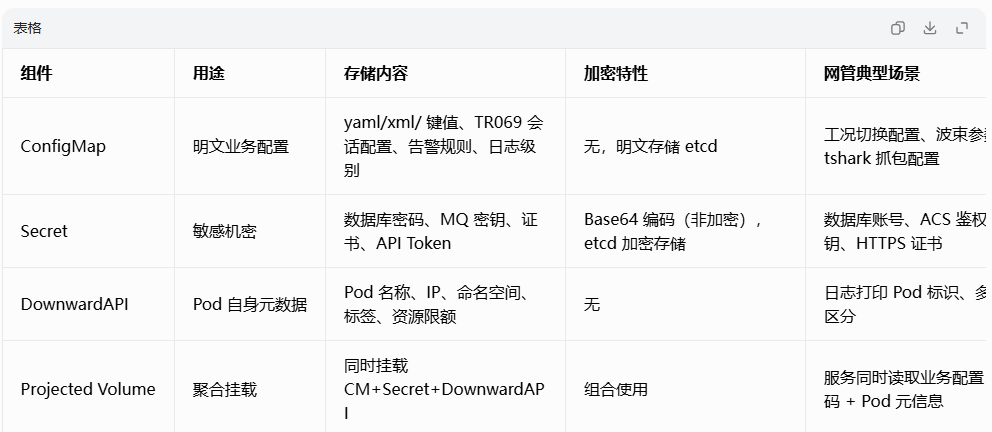

# 配置管理

**整体学习路线**
1. 基础概念：4 大配置载体（ConfigMap / Secret / DownwardAPI / Projected Volume）
2. ConfigMap 全实操：4 种创建方式、3 种注入模式、subPath 核心坑
3. Secret 实操：Opaque/ TLS/docker-registry、安全边界
4. DownwardAPI：注入 Pod 元数据（IP、名称、标签）
5. 高级：subPath 原理、配置热更新、多配置合并挂载
6. 工程级：多环境管理、Kustomize、生产最佳实践、网管落地规范

## 基础概念



核心约束：单个 CM/Secret 总大小上限 1MB，超大配置不适合；全部资源命名空间隔离。

## configMap

### 2.1 四种创建 ConfigMap 方式（实操命令）

方式 1：命令行字面量 --from-literal（单键值）
```shell
# 存储日志级别、TR069会话超时两个配置
kubectl create cm omc-base-cfg \
--from-literal=LOG_LEVEL=INFO \
--from-literal=TR069_SESSION_TIMEOUT=120
# 查看
kubectl get cm
kubectl describe cm omc-base-cfg
# 导出yaml（备份）
kubectl get cm omc-base-cfg -o yaml > cm-base.yaml
```

方式 2：从本地配置文件创建（网管 xml/yaml 最常用）

新建本地 tr069-session.xml
```xml
<!-- TR069会话配置 -->
<session>
  <maxConcurrent>50</maxConcurrent>
  <alarmQueueSize>1000</alarmQueueSize>
</session>
```

创建 cm，文件名 = key，文件内容 = value
```shell
kubectl create cm omc-tr069-cfg --from-file=./tr069-session.xml
# 查看内部key
kubectl get cm omc-tr069-cfg -o jsonpath='{.data}'

# 查看cm
[root@k8s-node1 ~]# kubectl describe cm omc-tr069-cfg
Name:         omc-tr069-cfg
Namespace:    default
Labels:       <none>
Annotations:  <none>

Data
====
tr069-session.xml:
----
<!-- TR069会话配置 -->
<session>
  <maxConcurrent>50</maxConcurrent>
  <alarmQueueSize>1000</alarmQueueSize>
</session>


BinaryData
====

Events:  <none>

```

方式 3：从整个配置目录批量创建
```shell
mkdir configs
# 放入tr069.xml、alarm-filter.yaml、beam.conf
kubectl create cm omc-all-cfg --from-file=./configs/
```

方式 4：yaml 清单创建（生产标准）cm-tr069.yaml
```yaml
apiVersion: v1
kind: ConfigMap
metadata:
  name: omc-tr069-full
  labels:
    app: omc-server
    module: tr069
data:
  # 单行键值
  TR069_MAX_SESSION: "200"
  # 多行配置文件 | 保留换行
  alarm-filter.yaml: |
    filter:
      suppressBootTempAlarm: true
      criticalAlarmForceReport: true
  tr069-session.xml: |
    <session>
      <timeout>120</timeout>
    </session>
```

```shell
kubectl apply -f cm-tr069.yaml
```

### 2.2 ConfigMap 三种注入 Pod 方式

**模式 1：注入环境变量 env（单个 key）**

pod-env.yaml
```yaml
apiVersion: v1
kind: Pod
metadata:
  name: omc-env-demo
spec:
  containers:
  - name: omc
    image: busybox:1.35
    command: ["sleep","3600"]
    env:
    # 单独引用cm中一个key
    - name: TR069_TIMEOUT
      valueFrom:
        configMapKeyRef:
          name: omc-base-cfg
          key: TR069_SESSION_TIMEOUT
```

实操命令
```shell
kubectl apply -f pod-env.yaml
# 进入容器验证环境变量
kubectl exec -it omc-env-demo -- env | grep TR069
```

特点：仅注入单个变量，不支持热更新，cm 修改 Pod 重启才生效。

**模式 2：全量注入环境变量 envFrom（批量）**
```yaml
apiVersion: v1
kind: Pod
metadata:
  name: omc-env-demo
spec:
  containers:
    - name: omc
      image: busybox:1.35
      command: ["sleep","3600"]
      envFrom:
        - configMapRef:
            name: omc-base-cfg
            optional: false # cm不存在Pod启动失败；true则忽略
          prefix: OMC_ # 所有变量统一加前缀 OMC_LOG_LEVEL
```

**模式 3：Volume 文件挂载（生产首选，支持热更新）**
不使用 subPath：整个目录挂载，覆盖容器原有文件夹
pod-volume.yaml
```yaml
apiVersion: v1
kind: Pod
metadata:
  name: omc-volume-demo
spec:
  containers:
  - name: omc
    image: busybox:1.35
    command: ["sleep","3600"]
    volumeMounts:
    - name: tr069-cfg-volume
      mountPath: /opt/omc/config # 整个目录替换
      readOnly: true # 配置只读，禁止程序写入
  volumes:
  - name: tr069-cfg-volume
    configMap:
      name: omc-tr069-full
```

验证：
```shell
kubectl apply -f pod-volume.yaml
kubectl exec -it omc-volume-demo -- ls /opt/omc/config
# 能看到 tr069-session.xml alarm-filter.yaml 两个文件
```
关键特性：无 subPath 目录挂载，cm 更新后 kubelet 自动同步文件，无需重启 Pod（热更新）

### 2.3 subPath 深度实操

痛点复现：无 subPath 覆盖目录问题

容器镜像 /opt/omc/config 自带 app.jar、log 目录，直接挂载整个 cm 目录会删除原有所有文件，服务启动失败。
subPath 解决方案：仅挂载单个文件，不覆盖父目录

pod-subpath.yaml
```yaml
volumeMounts:
- name: tr069-cfg-volume
  mountPath: /opt/omc/config/tr069-session.xml # 完整文件路径
  subPath: tr069-session.xml # cm内对应的key名称
volumes:
- name: tr069-cfg-volume
  configMap:
    name: omc-tr069-full
```

实操验证：
```shell
kubectl apply -f pod-subpath.yaml
# 父目录原有文件全部保留，仅替换tr069-session.xml
kubectl exec -it omc-subpath-demo -- ls /opt/omc/config
```

subPath 致命限制（生产必记）
* subPath 挂载不支持热更新：修改 ConfigMap，文件不会同步，必须重建 Pod 才生效
* subPath 只能挂载单个文件，不支持子目录批量挂载
* 容器镜像原有同名文件会被覆盖，其他文件不受影响

实操对比实验：热更新差异
* 修改 cm 里 tr069-session.xml 内容 kubectl edit cm omc-tr069-full
* 进入无 subPath Pod：cat /opt/omc/config/tr069-session.xml → 内容已刷新
* 进入 subPath Pod：cat /opt/omc/config/tr069-session.xml → 内容不变
* 删除重建 subPath Pod 后，内容才更新

### 2.4 ConfigMap 更新与回滚实操
更新方式 1：apply 覆盖 yaml
```shell
# 修改cm-tr069.yaml内容
kubectl apply -f cm-tr069.yaml
```

更新方式 2：命令行重建覆盖
```shell
kubectl create cm omc-tr069-full --from-file=tr069-session.xml --dry-run=client -o yaml | kubectl apply -f -
```

回滚：查看历史修改、恢复旧版本
```shell
# 查看cm修改记录
kubectl rollout history configmap omc-tr069-full
# 直接编辑回退
kubectl edit cm omc-tr069-full
```

## Secret 完整实操（敏感配置）

### 3.1 Secret 三种类型
* Opaque（默认）：通用密钥、密码
* kubernetes.io/tls：HTTPS 证书
* kubernetes.io/dockerconfigjson：镜像仓库密钥

### 3.2 创建 Opaque Secret（数据库密码）
方式 1：命令行创建
```shell
kubectl create secret generic omc-db-secret \
--from-literal=DB_USER=omc_admin \
--from-literal=DB_PWD=Omc@2026
```

方式 2：yaml 创建（明文写 stringData，自动转 base64）

secret-db.yaml
```yaml
apiVersion: v1
kind: Secret
metadata:
  name: omc-db-secret
type: Opaque
# stringData 无需手动base64编码，提交集群自动加密存储
stringData:
  DB_USER: omc_admin
  DB_PWD: Omc@2026
```

```shell
kubectl apply -f secret-db.yaml
# 查看原始加密值（base64）
kubectl get secret omc-db-secret -o jsonpath='{.data.DB_PWD}'
# 解码查看明文
kubectl get secret omc-db-secret -o jsonpath='{.data.DB_PWD}' | base64 -d
```

### 3.3 Secret 注入 Pod（同 ConfigMap 语法）

1）环境变量注入

```yaml
env:
- name: DB_PASSWORD
  valueFrom:
    secretKeyRef:
      name: omc-db-secret
      key: DB_PWD
```

2）Volume 文件挂载（推荐，密码放文件）

```yaml
volumeMounts:
- name: secret-db
  mountPath: /opt/omc/secret
  readOnly: true
volumes:
- name: secret-db
  secret:
    secretName: omc-db-secret
# 文件权限默认0400，仅root可读，安全
```

### 3.4 Secret 安全生产规范
* Secret 仅 Base64 编码，不是加密，禁止提交 Git；
* 集群 etcd 必须开启加密存储；
* 严格 RBAC：仅服务账号可读对应 Secret；
* 禁止用 envFrom 全量注入 Secret，日志易打印泄露密码；
* 证书类使用 tls 类型 Secret，自动管理 crt/key 文件。

## DownwardAPI：注入 Pod 自身元数据

pod-downward.yaml
```yaml
apiVersion: v1
kind: Pod
metadata:
  name: omc-downward-demo
  labels:
    module: tr069
spec:
  containers:
  - name: omc
    image: busybox:1.35
    command: ["sleep","3600"]
    env:
    # 注入Pod名称、命名空间
    - name: POD_NAME
      valueFrom:
        fieldRef:
          fieldPath: metadata.name
    - name: POD_NAMESPACE
      valueFrom:
        fieldRef:
          fieldPath: metadata.namespace
    # 注入容器资源限制
    - name: MEM_LIMIT
      valueFrom:
        resourceFieldRef:
          resource: limits.memory
  # 挂载元数据为文件
  volumeMounts:
  - name: pod-meta
    mountPath: /podmeta
  volumes:
  - name: pod-meta
    downwardAPI:
      items:
      - path: pod-label
        fieldRef:
          fieldPath: metadata.labels
```

```shell
kubectl exec -it omc-downward-demo -- env | grep POD
kubectl exec -it omc-downward-demo -- cat /podmeta/pod-label
```

## Projected Volume：多配置聚合挂载（高级实操）

一次性同时挂载 ConfigMap + Secret + DownwardAPI，网管服务同时读取业务配置、数据库密码、Pod 元信息
pod-projected.yaml
```yaml
spec:
  containers:
  - name: omc
    image: busybox
    command: ["sleep","3600"]
    volumeMounts:
    - name: all-config
      mountPath: /opt/omc/allcfg
      readOnly: true
  volumes:
  - name: all-config
    projected:
      sources:
      # 1. cm业务配置
      - configMap:
          name: omc-tr069-full
      # 2. secret密码
      - secret:
          name: omc-db-secret
      # 3. pod元数据
      - downwardAPI:
          items:
          - path: pod-name
            fieldRef:
              fieldPath: metadata.name
```

```shell
kubectl apply -f pod-projected.yaml
kubectl exec -it omc-projected-demo -- ls /opt/omc/allcfg
```

## 核心难点：subPath 生产取舍规范

* 什么时候必须用 subPath
   
   容器目录内置二进制、日志目录、默认模板文件，不能整体覆盖目录：
   * /opt/omc/config 下有 omc-server.jar
   * 仅需要替换其中 tr069-session.xml、alarm.yaml
   → 使用 subPath 单文件挂载
* 什么时候禁止使用 subPath（推荐）
   需要不停机动态更新配置（TR069 会话参数、告警过滤规则在线修改）
   → 不用 subPath，独立空目录完整挂载，支持 kubelet 自动热更新
* 折中方案（网管项目最优）
   固定静态配置（编译后不变）：subPath 挂载
   可动态调整业务规则：独立空目录完整挂载，支持热更新

## 多环境配置管理（工程级实操 Kustomization）

目录结构（dev/test/prod 三套环境）
```text
omc-config/
├── base/
│   ├── kustomization.yaml
│   ├── cm-tr069.yaml
│   ├── secret-db.yaml
│   └── deploy.yaml
├── overlays/
    ├── dev/
    │   └── kustomization.yaml # 开发环境覆盖日志级别
    ├── test/
    └── prod/
```

base/kustomization.yaml
```yaml
apiVersion: kustomize.config.k8s.io/v1beta1
kind: Kustomization
resources:
- cm-tr069.yaml
- secret-db.yaml
- deploy.yaml
configMapGenerator:
- name: omc-tr069-full
  literals:
  - LOG_LEVEL=WARN
```

overlays/prod/kustomization.yaml
```yaml
apiVersion: kustomize.config.k8s.io/v1beta1
kind: Kustomization
resources:
- ../../base
# 生产环境覆盖日志级别ERROR
patches:
- patch: |-
    - op: replace
      path: /data/LOG_LEVEL
      value: ERROR
  target:
    kind: ConfigMap
    name: omc-tr069-full
```

```shell
# 查看渲染结果
kubectl kustomize ./omc-config/overlays/prod
# 直接部署到prod命名空间
kubectl apply -k ./omc-config/overlays/prod -n prod
```

## 生产最佳实践
* 区分 CM 与 Secret。TR069 参数、波束配置、告警规则 → ConfigMap；数据库密码、ACS 鉴权密钥 → Secret
* 挂载规范。动态可修改配置：独立目录完整挂载（热更新）；静态单文件：subPath 挂载
* 大小限制。单配置文件不超过 1MB，超大配置存入数据库 / 分布式配置中心（Nacos/Apollo）
* 权限管控。volumeMounts 统一 readOnly: true，应用禁止修改配置文件
* 多环境隔离。dev/test/prod 独立命名空间，使用 Kustomize 管理差异化配置
* CI/CD 规范。ConfigMap/Secret 纳入 Git 版本，Secret 使用加密工具（SOPS）提交仓库，禁止明文密钥

## 配套排查实操命令
```shell
# 1. 查看cm完整内容
kubectl get cm <name> -o yaml
# 2. 查看secret解码内容
kubectl get secret <name> -o jsonpath='{.data}' | jq 'to_entries|map({key:.key,value:.value|@base64d})'
# 3. 进入容器查看挂载文件
kubectl exec -it <pod> -- cat /opt/omc/config/tr069-session.xml
# 4. 检查pod配置挂载异常事件
kubectl describe pod <pod-name>
# 5. 批量导出所有配置备份
kubectl get cm,secret -n omc-demo -o yaml > all-config-backup.yaml
```