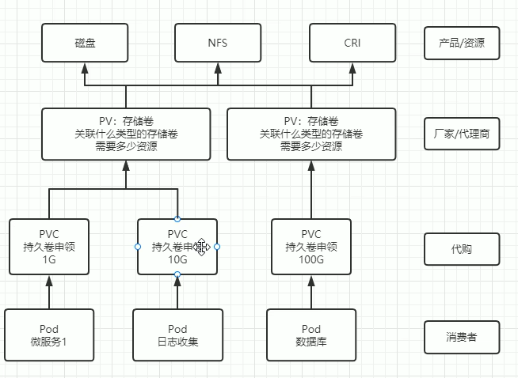
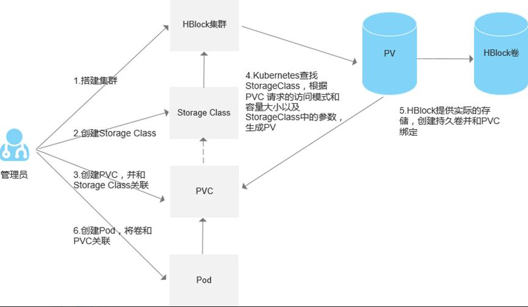

# 存储管理

访问顺序：pod->pvc->pv->资源


## 整体学习路线（由浅入深）

1. 基础卷（临时 / 本地 / 配置卷）：emptyDir、hostPath、ConfigMap/Secret 挂载、subPath
2. 持久化核心模型：PV/PVC 静态供给完整实操
3. 动态存储：StorageClass + CSI（天翼云 cstor-csi 私有云适配）
4. 有状态应用：StatefulSet 绑定 PVC 实战（Redis / 数据库）
5. 高级存储：扩容、快照、回收策略、访问模式、生产规范
   
前置环境：可用 kubectl，天翼私有云 K8s 集群，命名空间`omc-storage-demo`
```shell
kubectl create ns omc-storage-demo
kubectl config set-context --current --namespace=omc-storage-demo
```

## 第一章：基础临时 / 本地存储卷（非持久，实操）

### 1.1 emptyDir 临时共享卷（缓存、多容器互通）

Pod 调度到节点时创建空目录，**Pod 删除数据全部丢失**；同一 Pod 内多容器共享读写；可内存挂载（tmpfs）做高速缓存。

实操 yaml `pod-emptydir.yaml`
```yaml
apiVersion: v1
kind: Pod
metadata:
  name: empty-demo
spec:
  containers:
  # 容器1：写入数据
  - name: writer
    image: busybox
    command: ["sh","-c","echo TR069_CACHE_DATA > /cache/data.log; sleep 3600"]
    volumeMounts:
    - name: cache-vol
      mountPath: /cache
  # 容器2：读取共享目录
  - name: reader
    image: busybox
    command: ["sh","-c","cat /cache/data.log; sleep 3600"]
    volumeMounts:
    - name: cache-vol
      mountPath: /cache
  volumes:
  - name: cache-vol
    emptyDir:
      sizeLimit: 1Gi # 容量限制，防止占满节点磁盘
      # medium: Memory # 开启内存缓存，断电丢失
```

执行验证
```shell
kubectl apply -f pod-emptydir.yaml
# 查看读取容器输出
kubectl logs empty-demo -c reader
# 进入目录写入测试
kubectl exec -it empty-demo -c writer -- touch /cache/alarm.tmp
kubectl exec -it empty-demo -c reader -- ls /cache
# 删除Pod后数据消失
kubectl delete pod empty-demo
```

业务场景: TR069 报文临时缓存、tshark 抓包临时文件、日志中转；**不能存持久业务数据**。

### 1.2 hostPath 宿主机目录挂载（本地磁盘持久，单节点绑定）

直接映射节点宿主机文件 / 目录，数据留在节点磁盘；**Pod 重建调度到其他节点则丢失数据，生产慎用。**

实操 yaml `pod-hostpath.yaml`
```yaml
apiVersion: v1
kind: Pod
metadata:
  name: host-demo
spec:
  nodeSelector:
    kubernetes.io/hostname: node-01 # 强制固定节点，避免漂移丢数据
  containers:
  - name: omc-log
    image: busybox
    command: ["sh","-c","echo BEAM_LOG >> /host/logs/beam.log; sleep 3600"]
    volumeMounts:
    - name: host-log
      mountPath: /host/logs
  volumes:
  - name: host-log
    hostPath:
      path: /data/omc/logs # 宿主机目录
      type: DirectoryOrCreate # 不存在自动创建
```

验证
```shell
kubectl apply -f pod-hostpath.yaml
# 登录node-01节点查看宿主机文件
cat /data/omc/logs/beam.log
```

**优缺点**

✅ 节点本地磁盘性能高；❌ 多节点集群漂移丢数据，不适合分布式网管服务，仅单节点日志采集使用。

### 1.3 ConfigMap/Secret 挂载（配置卷，含 subPath 实操）

之前配置管理讲过，补充存储视角实操，区分**整目录挂载（热更新）** vs **subPath 单文件挂载（无热更新）**

```yaml
# cm-tr069.yaml
apiVersion: v1
kind: ConfigMap
metadata:
  name: tr069-cfg
data:
  session.xml: |
    <maxSession>200</maxSession>
  alarm-filter.yaml: |
    suppressTemp: true
```

```yaml
# pod-cm-mount.yaml
apiVersion: v1
kind: Pod
metadata:
  name: cm-mount-demo
spec:
  containers:
  - name: omc
    image: busybox
    command: ["sleep","3600"]
    volumeMounts:
    # 方式1：整目录挂载，支持cm热更新
    - name: tr069-cfg-vol
      mountPath: /opt/omc/cfg/all
    # 方式2：subPath单文件挂载，不覆盖父目录，无热更新
    - name: tr069-cfg-vol
      mountPath: /opt/omc/config/session.xml
      subPath: session.xml
  volumes:
  - name: tr069-cfg-vol
    configMap:
      name: tr069-cfg
```

## 第二章：持久化存储核心 PV/PVC 静态供给（生产基础）

### 2.1 核心概念

- **PV(PersistentVolume)**：管理员预先创建的底层存储资源（NFS / 云盘 / 块存储），独立 Pod 生命周期；
- **PVC(PersistentVolumeClaim)**：开发侧存储申请，声明容量、读写模式；
- 匹配逻辑：K8s 自动将符合容量、访问模式的 PV 绑定 PVC；删除 PVC 后按`reclaimPolicy`处理 PV。

**AccessModes 三种读写模式（必记）**

1. `ReadWriteOnce(RWO)`：仅单个节点读写（本地块盘默认）
2. `ReadOnlyMany(ROM)`：多节点只读（共享配置文件）
3. `ReadWriteMany(RWX)`：多节点同时读写（NFS / 弹性文件，适合多副本 Redis）

**回收策略 reclaimPolicy**

1. `Retain`：删除 PVC，PV 保留，数据不删，手动清理（生产数据安全首选）
2. `Delete`：删 PVC 同步删除底层存储（云盘默认）
3. `Recycle`：清空数据，PV 复用（已淘汰）

### 2.2 静态 PV 实操（NFS 示例，通用集群）

步骤 1：搭建 NFS 服务端（所有节点安装客户端）

```shell
# 服务端，在node1上安装
yum install -y nfs-utils rpcbind
mkdir -p /exports/k8s-pv
echo "/exports/k8s-pv 192.168.133.0/24(rw,sync,no_root_squash)" >> /etc/exports
exportfs -rav
systemctl enable --now nfs-server

# 所有k8s节点客户端安装
yum install -y nfs-utils
```

步骤 2：创建静态 PV `pv-nfs-static.yaml`
```yaml
apiVersion: v1
kind: PersistentVolume
metadata:
  name: nfs-pv-2g
spec:
  capacity:
    storage: 2Gi # 存储容量
  accessModes:
    - ReadWriteMany # 多节点读写
  persistentVolumeReclaimPolicy: Retain # 删PVC保留数据
  nfs:
    server: 192.168.133.129 # NFS服务IP
    path: /exports/k8s-pv
```

步骤 3：创建 PVC 申请存储 `pvc-nfs.yaml`
```yaml
apiVersion: v1
kind: PersistentVolumeClaim
metadata:
  name: omc-data-pvc
spec:
  accessModes:
    - ReadWriteMany
  resources:
    requests:
      storage: 1Gi # 申请1G，匹配2G PV自动绑定
```

步骤 4：Pod 挂载 PVC 使用 `pod-pvc-demo.yaml`
```yaml
apiVersion: v1
kind: Pod
metadata:
  name: pvc-use-demo
spec:
  containers:
  - name: omc-db
    image: busybox
    command: ["sh","-c","echo PERSIST_DATA >> /data/persist.log; sleep 3600"]
    volumeMounts:
    - name: biz-data
      mountPath: /data
  volumes:
  - name: biz-data
    persistentVolumeClaim:
      claimName: omc-data-pvc # 关联PVC名称
```

全套执行 & 验证命令
```shell
# 创建资源
kubectl apply -f pv-nfs-static.yaml
kubectl apply -f pvc-nfs.yaml
kubectl apply -f pod-pvc-demo.yaml

# 查看PV/PVC绑定状态
kubectl get pv,pvc
# 状态Bound代表绑定成功

# 写入持久数据，删除Pod重建验证数据不丢失
kubectl exec -it pvc-use-demo -- cat /data/persist.log
kubectl delete pod pvc-use-demo
kubectl apply -f pod-pvc-demo.yaml
kubectl exec -it pvc-use-demo -- cat /data/persist.log # 数据仍存在

# 删除PVC，PV状态变为Released，数据保留（Retain策略）
kubectl delete pvc omc-data-pvc
kubectl get pv
```

静态 PV 优缺点

✅ 底层存储可控；❌ 管理员需提前批量创建 PV，扩容繁琐，云生产优先动态 StorageClass。

## 第三章：动态存储 StorageClass + CSI

### 3.1 概念



本地虚拟机没有云厂商 CSI 驱动，使用开源`nfs-client-provisioner`，依托集群 NFS 共享目录，实现**StorageClass 动态自动创建 PV**。业务只需要创建 PVC，系统自动生成 PV 并绑定，无需管理员手动预建 PV。

**前置准备：NFS 服务端新增动态存储专用共享目录**

依旧在 k8s-node1 (NFS 服务端) 操作
```shell
mkdir -p /nfs/k8s-sc-dynamic
echo "/nfs/k8s-sc-dynamic 192.168.133.0/24(rw,sync,no_root_squash)" >> /etc/exports
exportfs -rav
```

### 3.2 创建 ServiceAccount 权限账号（provisioner 控制器需要集群权限创建 PV/PVC）

rbac-nfs-provisioner.yaml
```yaml
# 服务账号，给存储控制器使用
apiVersion: v1
kind: ServiceAccount
metadata:
  name: nfs-client-provisioner
  # 放到系统命名空间
  namespace: kube-system
---
# 集群角色：定义控制器操作PV/PVC/StorageClass的权限
apiVersion: rbac.authorization.k8s.io/v1
kind: ClusterRole
metadata:
  name: nfs-client-provisioner-runner
rules:
  # 管理PV权限
  - apiGroups: [""]
    resources: ["persistentvolumes"]
    verbs: ["get", "list", "watch", "create", "delete"]
  # 管理PVC权限
  - apiGroups: [""]
    resources: ["persistentvolumeclaims"]
    verbs: ["get", "list", "watch", "update"]
  # 读取存储类权限
  - apiGroups: ["storage.k8s.io"]
    resources: ["storageclasses"]
    verbs: ["get", "list", "watch"]
  # 记录事件日志
  - apiGroups: [""]
    resources: ["events"]
    verbs: ["create", "update", "patch"]
  - apiGroups: [""]
    resources: ["endpoints"]
    verbs: ["get", "list", "watch", "create", "update", "patch", "delete"]
---
# 绑定角色给上面创建的ServiceAccount
apiVersion: rbac.authorization.k8s.io/v1
kind: ClusterRoleBinding
metadata:
  name: run-nfs-client-provisioner
subjects:
  - kind: ServiceAccount
    name: nfs-client-provisioner
    namespace: kube-system
roleRef:
  kind: ClusterRole
  name: nfs-client-provisioner-runner
  apiGroup: rbac.authorization.k8s.io
```

执行权限配置
```shell
kubectl apply -f rbac-nfs-provisioner.yaml
```

### 3.3 部署 nfs-client-provisioner 控制器 Deployment

deploy-nfs-provisioner.yaml
```yaml
# 控制器部署，自动根据PVC生成PV
apiVersion: apps/v1
kind: Deployment
metadata:
  name: nfs-client-provisioner
  namespace: kube-system
spec:
  replicas: 1
  selector:
    matchLabels:
      app: nfs-client-provisioner
  strategy:
    type: Recreate
  template:
    metadata:
      labels:
        app: nfs-client-provisioner
    spec:
      serviceAccountName: nfs-client-provisioner
      containers:
        - name: provisioner
          # DaoCloud国内可访问加速镜像
          image: registry.k8s.io/sig-storage/nfs-subdir-external-provisioner:v4.0.2
          env:
            # 和StorageClass的provisioner名称严格一致
            - name: PROVISIONER_NAME
              value: k8s-sigs.io/nfs-subdir-external-provisioner
            # 你的NFS服务端IP
            - name: NFS_SERVER
              value: 192.168.133.129
            # NFS共享目录
            - name: NFS_PATH
              value: /exports/k8s-pv
          volumeMounts:
            - name: nfs-volume
              mountPath: /persistentvolumes
      volumes:
        - name: nfs-volume
          nfs:
            server: 192.168.133.129
            path: /exports/k8s-pv
```
验证命令
```shell
kubectl apply -f deploy-nfs-provisioner.yaml
# 查看控制器是否正常运行
kubectl get pod -n kube-system | grep nfs-client
```

又是拉不到镜像
```shell
kubectl describe po nfs-client-provisioner -n kube-system
# 输出
  Warning  Failed     2m16s                 kubelet            Failed to pull image "quay.io/external_storage/nfs-client-provisioner:latest": failed to pull and unpack image "quay.io/external_storage/nfs-client-provisioner:latest": failed to resolve reference "quay.io/external_storage/nfs-client-provisioner:latest": failed to do request: Head "https://docker.m.daocloud.io/v2/external_storage/nfs-client-provisioner/manifests/latest?ns=quay.io": net/http: TLS handshake timeout
  Warning  Failed     2m16s                 kubelet            Error: ErrImagePull
  Normal   BackOff    2m15s                 kubelet            Back-off pulling image "quay.io/external_storage/nfs-client-provisioner:latest"
  Warning  Failed     2m15s                 kubelet            Error: ImagePullBackOff
  Normal   Pulling    2m4s (x2 over 2m37s)  kubelet            Pulling image "quay.io/external_storage/nfs-client-provisioner:latest
```

试了好多办法，最后给了豆包提示词“给我浏览器可以下载的地址”。
> windows下执行docker命令，记得先启动docker-desktop
```shell
## 渡渡鸟镜像同步站（网页输入镜像名可查国内拉取地址）

[https://docker.aityp.com](https://link.wtturl.cn/?target=https%3A%2F%2Fdocker.aityp.com&scene=im&aid=497858&lang=zh)
操作步骤：

1. 浏览器打开网址
2. 搜索框输入：`registry.k8s.io/sig-storage/nfs-subdir-external-provisioner:v4.0.2`
3. 页面会给出华为云国内镜像拉取地址：

docker pull swr.cn-north-4.myhuaweicloud.com/ddn-k8s/registry.k8s.io/sig-storage/nfs-subdir-external-provisioner:v4.0.2

但是，当我查看在idea终端执行的命令时，我发现命令是
$ docker pull registry.k8s.io/sig-storage/nfs-subdir-external-provisioner:v4.0.2
v4.0.2: Pulling from sig-storage/nfs-subdir-external-provisioner
60775238382e: Pull complete 
528677575c0b: Pull complete 
Digest: sha256:63d5e04551ec8b5aae83b6f35938ca5ddc50a88d85492d9731810c31591fa4c9
Status: Downloaded newer image for registry.k8s.io/sig-storage/nfs-subdir-external-provisioner:v4.0.2
registry.k8s.io/sig-storage/nfs-subdir-external-provisioner:v4.0.2

根本没用华为镜像。
```

最后就是用正确的地址，就pull成功了。
```shell
Events:
  Type    Reason     Age    From               Message
  ----    ------     ----   ----               -------
  Normal  Scheduled  5m28s  default-scheduler  Successfully assigned kube-system/nfs-client-provisioner-665f85fc88-vzgn9 to k8s-node2
  Normal  Pulling    5m28s  kubelet            Pulling image "registry.k8s.io/sig-storage/nfs-subdir-external-provisioner:v4.0.2"
  Normal  Pulled     3m5s   kubelet            Successfully pulled image "registry.k8s.io/sig-storage/nfs-subdir-external-provisioner:v4.0.2" in 2m23.192s (2m23.192s including waiting)
  Normal  Created    3m5s   kubelet            Created container provisioner
  Normal  Started    3m5s   kubelet            Started container provisioner
```

### 3.4 sc-nfs-dynamic.yaml 存储类模板
```yaml
# 存储类：动态存储统一模板，业务PVC直接引用
apiVersion: storage.k8s.io/v1
kind: StorageClass
metadata:
  # 存储类名称，PVC中storageClassName引用
  name: nfs-dynamic-sc
  # 标记为集群默认存储类，PVC不写storageClassName自动使用这个
  annotations:
    storageclass.kubernetes.io/is-default-class: "true"
# 和控制器环境变量PROVISIONER_NAME保持一致
provisioner: k8s-sigs.io/nfs-subdir-external-provisioner
parameters:
  # 删除PVC时是否归档数据目录，false直接删除
  archiveOnDelete: "false"
# 回收策略：删PVC保留数据
reclaimPolicy: Retain
# 开启PVC在线扩容，不用重建存储
allowVolumeExpansion: true
```

```shell
kubectl apply -f sc-nfs-dynamic.yaml
# 查看集群所有存储类
kubectl get sc
```

### 3.5 pvc-dynamic.yaml 动态 PVC（无需手动创建 PV）

```yaml
apiVersion: v1
kind: PersistentVolumeClaim
metadata:
  name: dynamic-app-pvc
spec:
  # 指定使用我们创建的动态存储类
  storageClassName: nfs-dynamic-sc
  # NFS支持多节点读写
  accessModes:
    - ReadWriteMany
  # 申请1G持久化空间
  resources:
    requests:
      storage: 1Gi
```

```shell
kubectl apply -f pvc-dynamic.yaml
# 自动生成PV，查看绑定状态
kubectl get pv,pvc
```

### 3.6 deploy-test.yaml Deployment 挂载动态存储测试

```yaml
# 双副本Pod共享同一份NFS持久存储
apiVersion: apps/v1
kind: Deployment
metadata:
  name: nfs-test-deploy
spec:
  # 2个业务副本
  replicas: 2
  selector:
    matchLabels:
      app: nfs-test
  template:
    metadata:
      labels:
        app: nfs-test
    spec:
      containers:
      - name: test-app
        image: busybox
        # 启动写入持久文件
        command: ["sh","-c","echo DYNAMIC_NFS_DATA >> /data/dynamic.log; sleep 3600"]
        volumeMounts:
        - name: data-vol
          mountPath: /data
      volumes:
      - name: data-vol
        persistentVolumeClaim:
          claimName: dynamic-app-pvc
```

这里遇到pending报错
```shell
kubectl get pv,pvc

# 输出
persistentvolumeclaim/dynamic-app-pvc          Pending                                             nfs-dynamic-sc   28s

# 查看详细情况
kubectl describe pvc dynamic-app-pvc
# 输出
Name:          dynamic-app-pvc
Namespace:     default
StorageClass:  nfs-dynamic-sc
Status:        Pending
Volume:
Labels:        <none>
Annotations:   volume.beta.kubernetes.io/storage-provisioner: k8s-sigs.io/nfs-subdir-external-provisioner
               volume.kubernetes.io/storage-provisioner: k8s-sigs.io/nfs-subdir-external-provisioner
Finalizers:    [kubernetes.io/pvc-protection]
Capacity:
Access Modes:
VolumeMode:    Filesystem
Used By:       <none>
Events:
  Type    Reason                Age                   From                         Message
  ----    ------                ----                  ----                         -------
  Normal  ExternalProvisioning  14s (x19 over 4m41s)  persistentvolume-controller  Waiting for a volume to be created either by the external provisioner 'k8s-sigs.io/nfs-subdir-external-provisioner' or manually by the system administrator. If volume creation is delayed, please verify that the provisioner is running and correctly registered.

# 上面的日志表示负责CSI的nfs-client-provisioner没有帮我们创建PV
# 获取pod名称
kubectl get pod -n kube-system | grep nfs-client

# 查看pod日志
kubectl logs -f nfs-client-provisioner-665f85fc88-vzgn9 -n kube-system
# 输出用户没有获取到endpoints的API，实际就是缺少”endpoints 资源的 get 权限“
E0726 02:33:36.541000       1 leaderelection.go:320\] error retrieving resource lock kube-system/k8s-sigs.io-nfs-subdir-external-provisioner: endpoints "k8s-sigs.io-nfs-subdir-external-provisioner" is forbidden: User "system:serviceaccount:kube-system:nfs-client-provisioner" cannot get resource "endpoints" in API group "" in the namespace "kube-system"

# yaml文件加上权限
  - apiGroups: [""]
    resources: ["endpoints"]
    verbs: ["get", "list", "watch", "create", "update", "patch", "delete"]

# 重新应用rbac-nfs-provisioner.yaml
kubectl apply -f rbac-nfs-provisioner.yaml

# 重启 nfs-provisioner Pod 加载新权限
kubectl delete pod -n kube-system -l app=nfs-client-provisioner

# 查看log，发现没有报错了
kubectl logs -f nfs-client-provisioner-xxx -n kube-system

# 最后查看pv和pvc状态也正常了
kubectl get pv,pvc
# 输出
persistentvolumeclaim/dynamic-app-pvc          Bound
```

```shell
kubectl apply -f deploy-test.yaml
# 查看两个Pod，都能读写同一个文件
kubectl get pod
```

### 3.7 PVC 在线扩容操作

注意：nfs-subdir不支持在线扩容，只有云平台的CSI才支持。

```shell
# 编辑PVC文件，修改storage容量
kubectl edit pvc dynamic-app-pvc
# 将 resources.requests.storage:1Gi 修改为 2Gi
# 查看扩容事件，成功会输出VolumeExpandSuccess
kubectl describe pvc dynamic-app-pvc
```

## 第四章 StatefulSet 有状态应用自动 PVC（Redis 分片场景）

sts-redis.yaml 3 副本 Redis 分片，每个分片独立 PVC
```yaml
# 有状态控制器，每个Pod拥有独立固定存储、固定域名
apiVersion: apps/v1
kind: StatefulSet
metadata:
  name: redis-shard
spec:
  # Redis分片数量3个
  replicas: 3
  selector:
    matchLabels:
      app: redis-shard
  # 必须搭配无头Service，提供固定Pod域名 redis-shard-0.redis-headless
  serviceName: redis-headless
  # PVC模板：控制器自动为每个Pod创建独立PVC
  volumeClaimTemplates:
  - metadata:
      # 模板内卷名称，容器挂载引用
      name: redis-storage
    spec:
      # 使用动态NFS存储类
      storageClassName: nfs-dynamic-sc
      accessModes: [ReadWriteMany]
      # 每个分片分配1G存储
      resources:
        requests:
          storage: 1Gi
  # Pod模板
  template:
    metadata:
      labels:
        app: redis-shard
    spec:
      containers:
      - name: redis
        image: redis:6-alpine
        # 挂载分片独立持久目录
        volumeMounts:
        - name: redis-storage
          mountPath: /data
```

验证命令
```shell
kubectl apply -f sts-redis.yaml
# 自动生成3个独立PVC，分别绑定redis-shard-0/1/2
kubectl get pvc
# 实际只有一个PVC，先不管了
```

配套排错命令
```shell
# 查看集群所有PV、PVC资源，输出完整详情
kubectl get pv,pvc -o wide

# 查看PVC详细事件，定位挂载失败、扩容报错
kubectl describe pvc PVC名称

# 查看动态存储控制器日志，PVC无法自动创建PV必查
kubectl logs -n kube-system deploy/nfs-client-provisioner

# 进入Pod内部查看磁盘挂载情况
kubectl exec -it Pod名称 -- df -h

# 清理测试环境所有存储资源
kubectl delete pvc --all
kubectl delete pv --all
kubectl delete sc --all
```


