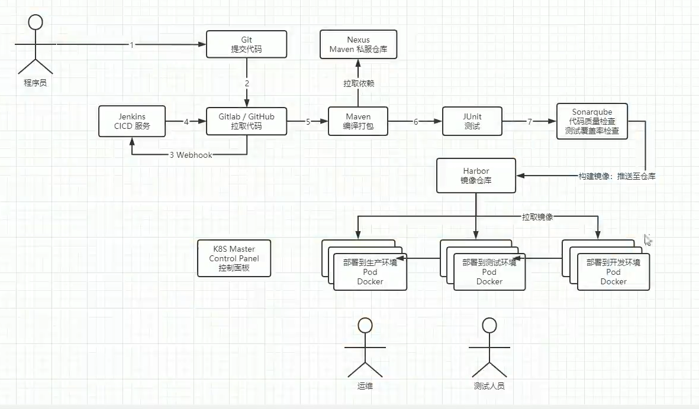

# devops

## 虚拟机设置代理

注意：不能在/etc/profile中设置永久代理，那样kubelet、calico‑node、kube‑proxy都会走代理，
会导致k8s集群内部网络出问题。只能是执行命令的shell设置临时代理，同时三台节点的container都需要
设置代理，以便每个节点都可以拉取镜像。

1、Clash设置，开启局域网连接。

2、需要执行helm命令的节点，在shell设置代理。
```shell
# http/https代理
export http_proxy=http://192.168.133.1:7897
export https_proxy=http://192.168.133.1:7897
# 集群内部无需代理
export no_proxy=localhost,127.0.0.1,192.168.133.0/24,10.96.0.0/12,10.244.0.0/16
```

3、windows防火墙允许7897

高级设置->新建规则，新建一条入网端口允许的规则

4、测试
```shell
curl -I https://hub.docker.com
```

5、设置containerd 镜像拉取代理

k8s 容器运行时 containerd 不会读取 linux 环境变量，三台节点都需要配置代理
```shell
mkdir -p /etc/systemd/system/containerd.service.d
vim /etc/systemd/system/containerd.service.d/http-proxy.conf
```

写入下面的内容
```shell
[Service]
Environment="HTTP_PROXY=http://192.168.133.1:7897"
Environment="HTTPS_PROXY=http://192.168.133.1:7897"
Environment="NO_PROXY=localhost,127.0.0.1,192.168.133.0/24,10.96.0.0/12,10.244.0.0/16,.svc,.svc.cluster.local"
```

重载服务、重启 containerd
```shell
systemctl daemon-reload
systemctl restart containerd
```

可以用命令测试代理是否正确
```shell

```

可以用命令手动下载镜像
```shell
export CRICTL_CONFIG=/etc/crictl.yaml
echo 'runtime-endpoint: unix:///run/containerd/containerd.sock' > /etc/crictl.yaml
crictl --runtime-endpoint unix:///run/containerd/containerd.sock pull goharbor/harbor-db:v2.14.1
```

取消shell中设置的代理
```shell
# 已经打开的shell，需要执行unset命令
unset http_proxy
unset https_proxy
unset no_proxy
```

## 什么是devops



## 安装harbor

harbor是私有docker镜像仓库，方便后续k8s拉取镜像。

在node2使用helm安装harbor
```shell
# 创建harbor专属命名空间
kubectl create ns harbor

# 添加 harbor 官方 helm 仓库
helm repo add harbor https://helm.goharbor.io
helm repo update

helm upgrade --install harbor harbor/harbor \
-n harbor \
--create-namespace \
--version 1.18.1 \
--set harborAdminPassword=Admin@123456 \
--set expose.type=nodePort \
--set expose.tls.enabled=false \
--set expose.nodePort.core=30003 \
--set externalURL=http://192.168.133.184:30003 \
--set persistence.persistentVolumeClaim.registry.storageClass=nfs-dynamic-sc \
--set persistence.persistentVolumeClaim.database.storageClass=nfs-dynamic-sc \
--set persistence.persistentVolumeClaim.redis.storageClass=nfs-dynamic-sc \
--set persistence.persistentVolumeClaim.jobservice.storageClass=nfs-dynamic-sc \
--set trivy.enabled=false \
--set core.startupProbe.initialDelaySeconds=120 \
--set database.startupProbe.initialDelaySeconds=90 \
--set redis.startupProbe.initialDelaySeconds=90 \
--set registry.resources.requests.cpu=100m \
--set registry.resources.requests.memory=256Mi \
--set jobservice.resources.requests.cpu=100m \
--set jobservice.resources.requests.memory=256Mi \
--set redis.resources.requests.cpu=100m \
--set redis.resources.requests.memory=256Mi \
--set database.resources.requests.cpu=100m \
--set database.resources.requests.memory=512Mi


# harbor比较大，大概pull了半小时才成功。但有报错
Events:
  Type     Reason     Age                  From               Message
  ----     ------     ----                 ----               -------
  Normal   Scheduled  58m                  default-scheduler  Successfully assigned harbor/harbor-core-5d84bdd76b-sm9vf to k8s-node3
  Normal   Pulling    58m                  kubelet            Pulling image "goharbor/harbor-core:v2.14.1"
  Normal   Pulled     30m                  kubelet            Successfully pulled image "goharbor/harbor-core:v2.14.1" in 14m26.578s (28m10.774s including waiting)
  Normal   Created    27m (x3 over 30m)    kubelet            Created container core
  Normal   Pulled     27m (x2 over 29m)    kubelet            Container image "goharbor/harbor-core:v2.14.1" already present on machine
  Warning  Unhealthy  25m (x22 over 29m)   kubelet            Startup probe failed: Get "http://10.244.107.232:8080/api/v2.0/ping": dial tcp 10.244.107.232:8080: connect: connection refused
  Normal   Started    5m16s (x9 over 30m)  kubelet            Started container core
  Warning  BackOff    8s (x105 over 28m)   kubelet            Back-off restarting failed container core in pod harbor-core-5d84bdd76b-sm9vf_harbor(6e8748be-10b6-46c7-be6d-e2be409f0eca)

# 查看日志进行排查，发现是redis连接失败
2026-08-09T14:10:23Z [ERROR] [/lib/cache/cache.go:126]: failed to ping redis://harbor-redis:6379/0?idle_timeout_seconds=30, retry after 500ms : dial tcp 10.104.127.240:6379: connect: connection refused

# 可以看到redis的pod没有启动成功
[root@k8s-node2 ~]# kubectl get pods -n harbor
NAME                                 READY   STATUS              RESTARTS      AGE
harbor-core-5d84bdd76b-sm9vf         0/1     CrashLoopBackOff    9 (82s ago)   61m
harbor-database-0                    1/1     Running             0             39m
harbor-jobservice-76db85467f-b8fkg   0/1     Pending             0             61m
harbor-nginx-86458b74c6-4v7gr        1/1     Running             0             61m
harbor-portal-58f5c655fc-42r4t       1/1     Running             0             61m
harbor-redis-0                       0/1     ContainerCreating   0             22m
harbor-registry-8f969fd6b-vt5kw      0/2     Pending             0             61m

# 查看redis事件，就是拉取镜像慢
kubectl describe pod harbor-redis-0 -n harbor

# 后面给虚拟机设置了代理，不知道是代理还是自己拉成功了，总之成功了
[root@k8s-node2 ~]# kubectl get pods -n harbor
NAME                                 READY   STATUS    RESTARTS       AGE
harbor-core-5d84bdd76b-sm9vf         1/1     Running   28 (12m ago)   24h
harbor-database-0                    1/1     Running   1 (18m ago)    24h
harbor-jobservice-76db85467f-b8fkg   0/1     Pending   0              24h
harbor-nginx-86458b74c6-4v7gr        1/1     Running   2 (17m ago)    24h
harbor-portal-58f5c655fc-42r4t       1/1     Running   1 (18m ago)    24h
harbor-redis-0                       1/1     Running   0              24h
harbor-registry-8f969fd6b-vt5kw      0/2     Pending   0              24h

# 还差harbor-jobservice和harbor-registry
# 查看 jobservice
kubectl describe pod harbor-jobservice-76db85467f-b8fkg -n harbor
# 查看 registry
kubectl describe pod harbor-registry-8f969fd6b-vt5kw -n harbor

# 豆包建议卸载、重装harbor
# 卸载harbor
helm uninstall harbor -n harbor
# 强制删除全部pod
kubectl delete pods -n harbor --all --force --grace-period=0
# 清空全部残留PVC
kubectl delete pvc --all -n harbor
# node1上的NFS 共享目录放宽权限，规避 NFS 权限故障
chmod 777 -R /exports/k8s-pv

# 最狗的是豆包给了一个新的安装命令，补齐了harbor-jobservice的pvc

# 好不容易代理设置好了，又遇到database启动不了
harbor-database-0                    0/1     Init:0/1            0               7m46s

# 用describe命令，然后豆包帮忙找到了原因（自己肉眼不容易看出来），卡住的是 init‑容器 data‑permissions‑ensurer

中间有一段是设置了container代理之后，没有重启container，导致一直报错创建不了沙盒，
访问不了https://10.96.0.1:443，重启container之后就好了。

sandbox: rpc error: code = Unknown desc = failed to setup network for sandbox "97993b714723d0785d1c16b91fb8b5edbf734b3d986d0686bc2346d20df66286": plugin type="calico" failed (add): error getting ClusterInformation: Get "[https://10.96.0.1:443/apis/crd.projectcalico.org/v1/clusterinformations/default](https://link.wtturl.cn/?target=https%3A%2F%2F10.96.0.1%3A443%2Fapis%2Fcrd.projectcalico.org%2Fv1%2Fclusterinformations%2Fdefault&scene=im&aid=497858&lang=zh)": EOF
Normal   SandboxChanged          6m9s (x30 over 37m)  kubelet            Pod sandbox changed, it will be killed and re-created.

# 问题解决之后，下载镜像还是失败，此时describe输出两个错都在，问了豆包，有时间先后顺序，
# 真实错误是ImagePullBackOff。
最后用crictl命令手动下载了镜像，它是可以用到container的代理的，而pod内部拉镜像需要另外设置代理。

```

**访问harbor**

http://192.168.133.129:30002
- 账号：`admin`
- 密码：`Admin@123456`


卸载harbor的命令
```shell
helm uninstall harbor -n harbor
kubectl delete pods -n harbor --all --force --grace-period=0
kubectl delete pvc --all -n harbor
```

## 安装Jenkins

```shell
# 添加仓库
helm repo add jenkins https://charts.jenkins.io
# 更新仓库索引
helm repo update jenkins
# 创建命名空间
kubectl create ns jenkins
# 完整安装命令
helm upgrade --install jenkins jenkins/jenkins \
-n jenkins \
--set controller.service.type=NodePort \
--set controller.service.nodePort=30080 \
--set controller.persistence.storageClass=nfs-dynamic-sc \
--set controller.persistence.size=15Gi \
--set controller.resources.requests.cpu=500m \
--set controller.resources.requests.memory=512Mi \
--set controller.resources.limits.cpu=1 \
--set controller.resources.limits.memory=1Gi \
--set prometheus.enabled=false \
--set grafana.enabled=false
# 查看pod状态
kubectl get pods -n jenkins -w
```