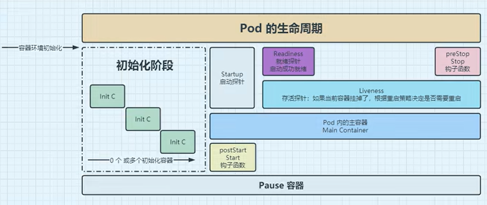

# k8s pod操作

## 创建pod

删除nginx相关的资源，包括删除deploy和service，删deploy的时候pod也自动删除
```shell
kubectl delete deployment nginx-demo
kubectl delete svc nginx-demo
```

### 前置基础认知
所有 K8s YAML 统一 5 个顶层固定字段（必背） 缺一不可：
```yaml
apiVersion: 资源所属API组版本 # 资源类型不同，版本不一样
kind: 资源类型 # Deployment/Pod/Service/Ingress等
metadata: # 元数据：名字、命名空间、标签、注释
  name: 资源名称
  namespace: 命名空间（默认default，不写就是default）
  labels: # 标签，用于Service关联Pod、筛选资源
    app: nginx
spec: # 资源期望状态，核心配置区，不同kind完全不一样
  # 每种资源独有的配置写在这里
# status: 不要手动写！集群自动生成，描述当前真实运行状态
```

配套工具（写 yaml 必备）
kubectl explain 资源类型：查每个字段官方解释，不用翻文档
```shell
# 查Deployment完整字段
kubectl explain deployment
# 精准查spec下的副本数字段
kubectl explain deployment.spec.replicas
```

kubectl get xx -o yaml：导出线上运行资源，参考标准写法
kubectl apply -f xxx.yaml --dry-run=client：预校验 yaml 语法，不创建资源

### 阶段 1：最小单元 Pod YAML（底层基础，理解容器运行逻辑）
实操 1：编写 pod-nginx.yaml
```yaml
apiVersion: v1
kind: Pod
metadata:
  name: nginx-pod
  namespace: default
  labels:
    app: nginx
    env: test
spec:
  # 容器列表，一个pod可以多容器
  containers:
  - name: nginx-container # 容器名称，pod内唯一
    image: nginx:alpine # 镜像地址
    ports:
    - containerPort: 80 # 容器内部监听端口
    resources: # 资源限制，生产必加
      requests: # 启动最低需要资源
        cpu: "100m" #最小10%CPU
        memory: "128Mi" #最少128M
      limits: # 资源上限，防止占满节点
        cpu: "200m" #最大10%CPU
        memory: "256Mi" #最大256M
```
实操执行命令
```shell
# 创建pod
kubectl apply -f pod-nginx.yaml
# 查看pod
kubectl get pods -o wide
# 查看pod详情，看启动事件
kubectl describe pod nginx-pod

# 进入容器访问nginx
kubectl exec -it nginx-pod -- sh
# 删除pod
kubectl delete -f pod-nginx.yaml
```

重点知识点
* Pod 不会自动重建，一旦删除 / 崩溃不会自愈，生产不用裸 Pod；
* labels 标签是 Service 匹配 Pod 的唯一桥梁；
* containerPort 只是标记端口，不做防火墙拦截。

### 阶段 2：无状态应用 Deployment（90% 业务使用，核心重点）
Deployment 用来管理多副本 Pod，支持扩缩容、滚动更新、版本回滚，是线上业务标准方案。
实操 2：编写 deploy-nginx.yaml
```yaml
apiVersion: apps/v1
kind: Deployment
metadata:
  name: nginx-demo
  labels:
    app: nginx # 作用：批量筛选Deployment，kubectl get deploy -l app=nginx
spec:
  replicas: 2 # 副本数量，启动2个pod
  selector: # 核心！匹配pod标签，必须和template.metadata.labels完全一致
    matchLabels:
      app: nginx # 作用：Deployment识别自己管理哪些Pod，不匹配就无限新建Pod
  template: # Pod模板，定义deployment创建出的pod长什么样
    metadata:
      labels:
        app: nginx # 作用：① 和selector配对；② Service靠这个标签转发流量到Pod
    spec:
      containers:
      - name: nginx-pod
        image: nginx:alpine
        ports:
        - containerPort: 80
        resources:
          requests:
            cpu: 100m
            memory: 128Mi
          limits:
            cpu: 200m
            memory: 256Mi
```

实操全套命令
```shell
# 1. 创建资源
kubectl apply -f deploy-nginx.yaml
# 2. 查看deployment、pod
kubectl get deploy,pods -o wide

# 3. 扩容到3副本（两种方式）
# 方式1命令扩容
kubectl scale deploy nginx-demo --replicas=3

# 方式2修改yaml里replicas=3，再apply
kubectl apply -f deploy-nginx.yaml
# 4. 滚动重启更新pod
kubectl rollout restart deployment nginx-demo
# 5. 查看发布历史、回滚
kubectl rollout history deploy nginx-demo
kubectl rollout undo deploy nginx-demo
# 6. 导出标准yaml（纯净备份）
kubectl get deploy nginx-demo -o yaml > deploy-bak.yaml
# 7. 删除整套deployment+pod
kubectl delete -f deploy-nginx.yaml
```

必考易错点
spec.selector.matchLabels 必须和 template.metadata.labels 完全一致，否则 Deployment 找不到自己管理的 Pod，会无限新建 Pod。

### 阶段 3：Service 四层网络资源（实现固定访问入口，衔接 Pod）
实操 3：svc-nginx.yaml（NodePort 类型，外部可访问）
```yaml
apiVersion: v1
kind: Service
metadata:
  name: nginx-svc
spec:
  type: NodePort # 类型：ClusterIP/NodePort/LoadBalancer
  selector: # 匹配Pod标签，和deployment的pod标签一致
    app: nginx
  ports:
  - port: 80        # Service集群内部端口（ClusterIP端口）
    targetPort: 80  # Pod容器端口
    nodePort: 30080 # 节点暴露端口，范围30000-32767
    protocol: TCP
```

实操命令（注意service只是提供东西和南北向访问，真正提供服务的是deploy部署的pod，因此deploy需要先创建出来。）
```shell
# 创建deploy
kubectl apply -f deploy-nginx.yaml
# 创建service
kubectl apply -f svc-nginx.yaml
# 查看service，查看映射端口
kubectl get svc
# 集群内部pod访问测试
kubectl run curl-test --image=curlimages/curl --rm -it -- curl nginx-svc:80
# 外部访问：任意节点IP:30080
curl 192.168.133.129:30081
# 删除service
kubectl delete -f svc-nginx.yaml
```

### 阶段 4：多资源合并写在同一个 yaml
（--- 分割符，生产常用）
多个资源可以写到一个文件，用 --- 分隔，一次性创建 / 删除整套业务。
实操 4：all-in-one.yaml（Deployment + Service 合并）
```yaml
# Deployment部分
apiVersion: apps/v1
kind: Deployment
metadata:
  name: nginx-demo
spec:
  replicas: 2
  selector:
    matchLabels:
      app: nginx
  template:
    metadata:
      labels:
        app: nginx
    spec:
      containers:
      - name: nginx
        image: nginx:alpine
        ports:
        - containerPort: 80
---
# Service部分
apiVersion: v1
kind: Service
metadata:
  name: nginx-svc
spec:
  type: NodePort
  selector:
    app: nginx
  ports:
  - port: 80
    targetPort: 80
    nodePort: 30081
```

实操命令
```shell
# 一次性创建两个资源
kubectl apply -f all-in-one.yaml
# 一次性删除两个资源
kubectl delete -f all-in-one.yaml
```

排坑重点（写 yaml 高频错误）
* 缩进错误：yaml 严格空格缩进，禁止 tab，层级不对直接报错；
* apiVersion 版本错误
  * Pod/Service/Namespace：apiVersion: v1
  * Deployment/DaemonSet：apiVersion: apps/v1
  * Ingress：apiVersion: networking.k8s.io/v1
* selector 标签不匹配，Deployment 找不到 Pod、Service 找不到后端 Pod；
* 字段拼写错误，不会自动提示，用kubectl explain核对字段名；
* nodePort 超出 30000-32767 范围。

## pod探针
一、探针核心概念
探针（Probe）是 kubelet 周期性执行的健康检测，用来判断容器是否正常工作，分为三类：
* livenessProbe 存活探针：容器崩了、卡死无响应 → 杀死重建 Pod
* readinessProbe 就绪探针：容器还没初始化完成，不能接收流量 → Service 不把流量转发给它
* startupProbe 启动探针：容器启动慢（大应用、数据库），给充足启动时间，启动成功后另外两个探针才开始检测

三种检测方式（三类探针通用）
* exec：执行容器内命令，返回码 0 代表健康
* httpGet：访问容器内 HTTP 接口，2xx/3xx 为健康（最常用 web 服务）
* tcpSocket：检测端口是否监听，端口通则健康

核心执行参数（所有探针共用）
```yaml
initialDelaySeconds: 5  # Pod启动后，延迟多久第一次检测
periodSeconds: 10        # 每隔多少秒检测一次
timeoutSeconds: 3        # 单次检测超时时间，超过判定失败
failureThreshold: 3     # 连续失败多少次执行对应动作
successThreshold: 1     # 连续成功多少次标记健康
```

二、实操 1：httpGet 探针（Nginx Web 服务，企业最常用）
1. 完整 yaml deploy-probe-http.yaml
```yaml
apiVersion: apps/v1
kind: Deployment
metadata:
  name: nginx-probe
  labels:
    app: nginx-probe
spec:
  replicas: 1
  selector:
    matchLabels:
      app: nginx-probe
  template:
    metadata:
      labels:
        app: nginx-probe
    spec:
      containers:
      - name: nginx
        image: nginx:alpine
        ports:
        - containerPort: 80
        # 就绪探针：启动5秒后开始，每10秒访问/
        readinessProbe:
          httpGet:
            path: /
            port: 80
          initialDelaySeconds: 5
          periodSeconds: 10
        # 存活探针：卡死则重启Pod
        livenessProbe:
          httpGet:
            path: /
            port: 80
          initialDelaySeconds: 10
          periodSeconds: 10
```

实操命令
```shell
# 创建资源
kubectl apply -f deploy-probe-http.yaml
# 查看pod状态，观察 READY 从0/1 →1/1（readiness探针通过后才就绪）
kubectl get pods -w
# 查看探针配置详情
kubectl describe pod $(kubectl get pods | grep nginx-probe | awk '{print $1}')
```

模拟故障：让 http 接口访问失败，观察 liveness 重启 Pod
```shell
# 进入容器删除首页，接口404，探针持续失败
kubectl exec -it deploy/nginx-probe -- rm /usr/share/nginx/html/index.html
# 持续观察pod，连续失败3次后pod会被重建
kubectl get pods -w
```

清理
```shell
kubectl delete -f deploy-probe-http.yaml
```

三、实操 2：exec 命令探针（无 web 端口，后台程序）
原理：执行容器内部命令，返回 0 = 健康，非 0 = 失败
deploy-probe-exec.yaml
```yaml
apiVersion: apps/v1
kind: Deployment
metadata:
  name: busybox-probe
  labels:
    app: busybox-probe
spec:
  replicas: 1
  selector:
    matchLabels:
      app: busybox-probe
  template:
    metadata:
      labels:
        app: busybox-probe
    spec:
      containers:
        - name: busybox
          image: busybox:1.36
          # 前台持续sleep，保证Pod不会自动退出
          command:
            - sh
            - -c
            - |
              touch /tmp/healthy
              while true; do sleep 1; done
          # 就绪探针：检测健康文件，失败则Pod Ready=false，Service不分配流量
          readinessProbe:
            exec:
              command: ["cat", "/tmp/healthy"]
            initialDelaySeconds: 3
            periodSeconds: 5
            timeoutSeconds: 2
            failureThreshold: 2
          # 存活探针：同样检测文件，连续失败后杀死重建容器
          livenessProbe:
            exec:
              command: ["cat", "/tmp/healthy"]
            initialDelaySeconds: 8
            periodSeconds: 5
            timeoutSeconds: 2
            failureThreshold: 5
```

实操故障模拟
```shell
kubectl apply -f deploy-probe-exec.yaml
# 获取pod名称
POD=$(kubectl get pods | grep busybox-probe | awk '{print $1}')
#此时pod正常
kubectl describe pod $POD
#持续观察
kubectl get pods -w
# 删除健康标记文件
kubectl exec $POD -- rm -f /tmp/healthy
#持续观察看到READY 变成 0/1；RESTARTS 重启次数 不会增加；
#结论：readiness 失败只会标记未就绪，不会重启容器。

#再次执行describe命令，能看到提示 Readiness probe failed。
kubectl describe pod $POD

#等待约 15 秒，持续探测 3 次失败后：Pod RESTARTS 数字 +1；
#旧容器被杀死，自动新建 Pod；新 Pod 内部脚本会重新执行 touch /tmp/healthy，恢复正常就绪 1/1。
```

清理
```shell
kubectl delete -f deploy-probe-exec.yaml
```

四、实操 3：tcpSocket 端口探针（TCP 服务：mysql、redis）
只检测容器端口是否监听，不用 http 接口
deploy-probe-tcp.yaml
```yaml
apiVersion: apps/v1
kind: Deployment
metadata:
  name: redis-probe
  labels:
    app: redis-probe
spec:
  replicas: 1
  selector:
    matchLabels:
      app: redis-probe
  template:
    metadata:
      labels:
        app: redis-probe
    spec:
      containers:
      - name: redis
        image: redis:alpine
        ports:
        - containerPort: 6379
        readinessProbe:
          tcpSocket:
            port: 6379
          initialDelaySeconds: 5
          periodSeconds: 10
        livenessProbe:
          tcpSocket:
            port: 6379
          initialDelaySeconds: 10
          periodSeconds: 10
```

实操
```shell
kubectl apply -f deploy-probe-tcp.yaml
kubectl get pods -w
kubectl describe pod $(kubectl get pods | grep redis-probe | awk '{print $1}')
kubectl delete -f deploy-probe-tcp.yaml
```

五、实操 4：startupProbe 启动探针（慢启动应用场景）
场景：Java 微服务、数据库启动需要 30 秒以上，普通探针还没等启动完就误杀 Pod逻辑：startup 探针成功之前，liveness/readiness 完全不执行
```yaml
apiVersion: apps/v1
kind: Deployment
metadata:
  name: slow-app-probe
spec:
  replicas: 1
  selector:
    matchLabels:
      app: slow-app
  template:
    metadata:
      labels:
        app: slow-app
    spec:
      containers:
      - name: slow
        image: busybox
        # 模拟程序30秒后才能正常提供服务
        command: ["sh","-c","sleep 30; touch /tmp/ready; sleep 3600"]
        # 启动探针：最多等待40秒，每5秒检测一次
        startupProbe:
          exec:
            command: ["cat","/tmp/ready"]
          failureThreshold: 8
          periodSeconds: 5
        # 启动完成后才会执行下面两个探针
        readinessProbe:
          exec:
            command: ["cat","/tmp/ready"]
          initialDelaySeconds: 2
        livenessProbe:
          exec:
            command: ["cat","/tmp/ready"]
          initialDelaySeconds: 2
```

实操
```shell
kubectl apply -f deploy-probe-startup.yaml
#清理
kubectl delete -f deploy-probe-startup.yaml
```

## pod生命周期
图解pod生命周期


一、Pod 生命周期整体总览
Pod 从创建到销毁完整阶段：
* 创建调度阶段：API 对象创建 → 调度器绑定节点 → 拉取镜像
* 容器初始化阶段：init 容器顺序执行
* 主容器启动：启动探针 startupProbe 检测
* 运行就绪阶段：就绪探针 readinessProbe（Ready 状态、接入 Service 流量）
* 运行存活阶段：存活探针 livenessProbe（卡死自动重启）
* 终止退出阶段：收到删除信号 → preStop 钩子优雅关闭 → 容器停止 → 资源回收

二、关键状态释义（kubectl get pods 看到的 STATE）
* Pending：已创建 Pod 资源，未调度 / 拉镜像 /init 容器未完成
* ContainerCreating：镜像拉取完成，正在创建容器
* Running：所有主容器启动成功，正常运行
* Ready：数字 1/1 代表就绪探针通过，可接收流量
* CrashLoopBackOff：容器反复启动失败、退出，循环重启
* Terminating：收到删除指令，正在优雅终止

实操 1：Init 初始化容器（Pod 启动前置执行）
init 容器串行执行，全部执行成功后主容器才启动；常用于初始化配置、数据库迁移、等待依赖服务就绪。
pod-init.yaml
```yaml
apiVersion: v1
kind: Pod
metadata:
  name: pod-init-demo
spec:
  initContainers:
    - name: init-wait
      image: busybox
      command: ["sh","-c","echo 等待依赖服务; sleep 5"]
    - name: init-config
      image: busybox
      command: ["sh","-c","echo 初始化配置内容 > /data/config.txt"]
      volumeMounts:
        - name: data-volume
          mountPath: /data
  containers:
    - name: nginx
      image: nginx:alpine
      volumeMounts:
        - name: data-volume
          mountPath: /usr/share/nginx/html
      # 直接把共享目录挂载为网页目录，不用cp复制
      ports:
        - containerPort: 80
  volumes:
    - name: data-volume
      emptyDir: {}
```

实操流程
```shell
# 创建pod
kubectl apply -f pod-init.yaml
# 实时观察状态：先Pending，init执行完才进入Running
kubectl get pods -w
# 查看Pod完整事件，能看到init容器执行记录
kubectl describe pod pod-init-demo
# 进入容器验证初始化生成的文件
kubectl exec -it pod-init-demo -- cat /usr/share/nginx/html/config.txt
# 清理
kubectl delete pod pod-init-demo
kubectl delete -f pod-init.yaml
```

实操 2：生命周期钩子 postStart & preStop
钩子说明
* postStart：容器启动完成后立刻执行，不阻塞容器就绪（异步），用于启动后初始化逻辑
* preStop：容器收到删除信号时执行，优雅关闭逻辑；默认 30 秒宽限期，超时强制杀进程

pod-hook.yaml
```yaml
apiVersion: v1
kind: Pod
metadata:
  name: pod-hook-demo
spec:
  terminationGracePeriodSeconds: 60
  containers:
    - name: nginx
      image: nginx:alpine
      # 固定前台运行，不会收到信号直接退出
      command:
        - sh
        - -c
        - |
          nginx -g 'daemon off;'
      ports:
        - containerPort: 80
      lifecycle:
        postStart:
          exec:
            # 分步创建文件再写入，避免文件不存在报错
            command: ["sh", "-c", "mkdir -p /tmp && echo postStart钩子执行 >> /tmp/hook.log"]
        preStop:
          exec:
            command: ["sh","-c","echo preStop优雅关闭执行 >> /tmp/hook.log; sleep 25"]
```

实操命令
```shell
kubectl apply -f pod-hook.yaml
kubectl exec -it pod-hook-demo -- cat /tmp/hook.log
# 输出：容器启动钩子执行

#新开窗口实时监控事件
kubectl get pods pod-hook-demo -w
kubectl delete pod pod-hook-demo
#Pod 状态变为Terminating，不会立刻消失，等待 25 秒后销毁；执行下面的命令可看到输出“preStop优雅关闭执行”
kubectl exec pod-hook-demo -- cat /tmp/hook.log
```

完整全流程综合 Demo（init 容器 + 钩子 + 三类探针）
all-in-one-lifecycle.yaml
```yaml
apiVersion: v1
kind: Pod
metadata:
  name: pod-all-lifecycle
spec:
  initContainers:
  - name: init-prepare
    image: busybox
    command: ["sh","-c","echo 初始化完成 > /data/init.log"]
    volumeMounts:
    - name: data
      mountPath: /data
  containers:
  - name: nginx
    image: nginx:alpine
    volumeMounts:
    - name: data
      mountPath: /data
    command: ["sh","-c","cp /data/init.log /usr/share/nginx/html/index.html; nginx -g 'daemon off;'"]
    ports:
    - containerPort: 80
    # 三大探针
    startupProbe:
      httpGet: {path: /, port: 80}
      periodSeconds: 3
      failureThreshold: 10
    readinessProbe:
      httpGet: {path: /, port: 80}
      periodSeconds: 3
    livenessProbe:
      httpGet: {path: /, port: 80}
      periodSeconds: 5
    # 生命周期钩子
    lifecycle:
      postStart:
        exec: {command: ["sh","-c","echo postStart钩子 >> /data/hook.log"]}
      preStop:
        exec: {command: ["sh","-c","echo preStop优雅关闭 >> /data/hook.log; sleep 5"]}
  volumes:
  - name: data
    emptyDir: {}
```

常用命令：
```shell
# 强制删除某个一直Terminating的pod
kubectl delete pod harbor-core-5d84bdd76b-sm9vf -n harbor --force --grace-period=0
```

