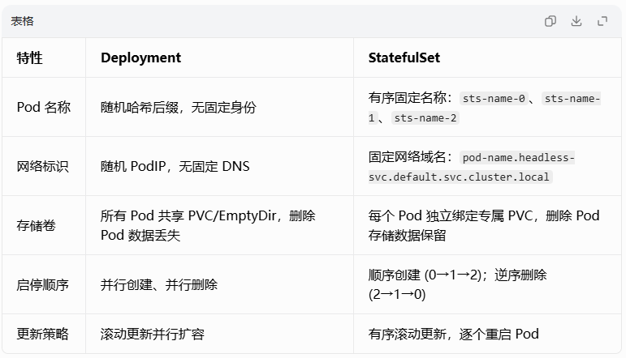

# 资源调度-StatefulSet

## 一、前置核心认知
1. StatefulSet 定位
   API 版本：apps/v1
   
专门管理有状态应用的控制器：MySQL、Redis 集群、Elasticsearch、ZooKeeper、MQ 等。

2. 无状态 Deployment VS 有状态 StatefulSet 核心区别



3. StatefulSet 依赖两大配套资源
   
* **Headless Service（无头服务）** spec.clusterIP: None，不分配集群 IP，仅提供 Pod 固定域名解析，是 StatefulSet 必备。
   
* **PVC 持久存储模板** volumeClaimTemplates
   自动为每个序号 Pod 创建独立 PVC，数据持久化，Pod 删除 PVC 不会自动删除。

4. 整体调度链路

StatefulSet → Headless Service → 有序 Pod + 独立 PVC
   控制器保证：稳定网络身份、稳定持久存储、有序启停。

## 基础完整模板

**重要前置约束**
*    local PV 的 path 目录必须提前在对应节点手动创建，k8s 不会自动生成目录
*    PV 里 nodeAffinity 要填你集群真实节点名，否则调度不匹配
*    local-storage 类型 PV 不会自动扩容，3 个副本需要3 个独立 PV（每个 Pod 对应 1 个 PV）

**步骤一、创建local-storage**
新建 sc.yaml
```yaml
apiVersion: storage.k8s.io/v1
kind: StorageClass
metadata:
   name: local-storage
provisioner: kubernetes.io/no-provisioner
volumeBindingMode: WaitForFirstConsumer #local PV 不会提前绑定 PVC，等到 Pod 调度到匹配节点后，PVC 才会和 PV 绑定，不会一开始就 Pending 报错。
```
实操命令
```shell
kubectl apply -f sc.yaml
# 验证sc存在
kubectl get sc
# 必须能看到 local-storage 才算成功
```

**步骤二、创建PV**
单独创建 3 个 PV（pv.yaml）
```yaml
# 1. PV 0 给 sts-demo-0
apiVersion: v1
kind: PersistentVolume
metadata:
   name: pv-1g-0
spec:
   capacity:
      storage: 1Gi # 1GB资源
   accessModes:
      - ReadWriteOnce
   storageClassName: local-storage
   persistentVolumeReclaimPolicy: Delete
   local:
      path: /data/localpv0  # 节点提前mkdir -p /data/localpv0
   nodeAffinity:
      required:
         nodeSelectorTerms:
            - matchExpressions:
                 - key: kubernetes.io/hostname
                   operator: In
                   values:
                      - k8s-node1 # 替换成你的节点主机名
---
# 2. PV 1 给 sts-demo-1
apiVersion: v1
kind: PersistentVolume
metadata:
   name: pv-1g-1
spec:
   capacity:
      storage: 1Gi
   accessModes:
      - ReadWriteOnce
   storageClassName: local-storage
   persistentVolumeReclaimPolicy: Delete
   local:
      path: /data/localpv1
   nodeAffinity:
      required:
         nodeSelectorTerms:
            - matchExpressions:
                 - key: kubernetes.io/hostname
                   operator: In
                   values:
                      - k8s-node2
---
# 3. PV 2 给 sts-demo-2
apiVersion: v1
kind: PersistentVolume
metadata:
   name: pv-1g-2
spec:
   capacity:
      storage: 1Gi
   accessModes:
      - ReadWriteOnce
   storageClassName: local-storage
   persistentVolumeReclaimPolicy: Delete
   local:
      path: /data/localpv2
   nodeAffinity:
      required:
         nodeSelectorTerms:
            - matchExpressions:
                 - key: kubernetes.io/hostname
                   operator: In
                   values:
                      - k8s-node3
```
实操命令
```shell
kubectl apply -f pv.yaml
# 查看pv状态 Available
kubectl get pv
```

**步骤三、创建StatefulSet**

sts-demo.yaml
```yaml
# 1.前置：Headless 无头服务（必须先创建）
apiVersion: v1
kind: Service
metadata:
  name: sts-svc
spec:
  selector:
    app: sts-demo
  clusterIP: None  # 无头服务核心标识
  ports:
  - port: 80
    targetPort: 80
---
# 2. StatefulSet 主体
apiVersion: apps/v1
kind: StatefulSet
metadata:
  name: sts-demo
spec:
  replicas: 3
  # 绑定无头服务名称
  serviceName: sts-svc
  selector:
    matchLabels:
      app: sts-demo
  # 持久卷模板：自动给每个pod生成独立pvc
  volumeClaimTemplates:
  - metadata:
      name: data-volume
    spec:
      storageClassName: "local-storage" # 替换你集群真实sc名称
      accessModes: [ "ReadWriteOnce" ]
      resources:
        requests:
          storage: 1Gi
  template:
    metadata:
      labels:
        app: sts-demo
    spec:
      containers:
      - name: nginx
        image: nginx:alpine
        ports:
        - containerPort: 80
        # 挂载专属持久卷
        volumeMounts:
        - name: data-volume
          mountPath: /usr/share/nginx/html
```

实操命令
```shell
# 创建 sts + headless svc
kubectl apply -f sts-demo.yaml

# 同时查看 sts、pod、pvc、svc
kubectl get sts,pods,pvc,svc -o wide

# 查看sts详情，启停顺序、存储模板
kubectl describe sts sts-demo
```

## 三、四大核心特性分步实操（逐个验证）

**实操 1：固定有序 Pod 名称 + 启停顺序**

1. 创建过程顺序
  
   执行 apply 后，观察 -w 窗口：
```shell
kubectl get pods -w
```

流程：
* sts-demo-0 先创建并 Running；
* 0 就绪后，才创建 sts-demo-1；
* 1 就绪后，才创建 sts-demo-2。

2. 删除逆序销毁

```shell
kubectl delete -f sts-demo.yaml
```

销毁顺序：2 → 1 → 0，从高序号到低序号依次删除。

3. 扩容测试

```shell
kubectl scale sts sts-demo --replicas=5
```

新增 pod 3、pod 4，依旧按顺序生成，不会插队。

**实操 2：Headless Service 固定 DNS 域名（集群内稳定网络身份）**

1. 进入临时测试 Pod 解析域名

```shell
# 检查coredns是否正常运行
kubectl get pods -n kube-system | grep coredns
# 查看coredns日志排查解析异常
kubectl logs -n kube-system coredns-66f779496c-9j4f5 # 按需修改pod名称
# 再检查服务的Selector、Endpoint
kubectl describe svc sts-svc
# 直接进容器内部调试 DNS
kubectl exec -it sts-demo-0 -- /bin/sh
nslookup sts-demo-1.sts-svc.default.svc.cluster.local
ping sts-demo-1.sts-svc 
curl sts-demo-1.sts-svc
# 不进容器，用 alpine 带 dig 工具一次性测试
kubectl run dig-test --image=alpine --rm -it -- sh -c "
apk add --no-cache bind-tools;
echo '查询完整FQDN';
dig A sts-demo-0.sts-svc.default.svc.cluster.local;
echo '查询service域名';
dig A sts-svc.default.svc.cluster.local;
"
# 验证另外两个Pod
kubectl run dig-test --image=alpine --rm -it -- sh -c "
apk add --no-cache bind-tools;
dig A sts-demo-1.sts-svc.default.svc.cluster.local;
dig A sts-demo-2.sts-svc.default.svc.cluster.local;
"
```

域名规则：
`pod名称.sts服务名.命名空间.svc.cluster.local`

完整域名：
`sts-demo-0.sts-svc.default.svc.cluster.local`

2. 通过域名互相访问

```shell
# 进入0号pod，访问1号pod
kubectl exec -it sts-demo-0 -- curl sts-demo-1.sts-svc.default.svc.cluster.local
# 进入0号pod，访问2号pod
kubectl exec -it sts-demo-0 -- curl sts-demo-2.sts-svc.default.svc.cluster.local
```

即使 Pod 重建、IP 变化，域名永久不变，集群中间件集群依赖该稳定标识做节点识别。

**实操 3：独立持久存储 PVC（数据不随 Pod 删除丢失）**

```shell
#1. 写入数据到 0 号 pod 持久目录
kubectl exec -it sts-demo-0 -- sh -c "echo 'stateful data pod0' > /usr/share/nginx/html/index.html"
# 访问验证
kubectl exec -it sts-demo-1 -- curl sts-demo-0.sts-svc.default.svc.cluster.local
#2. 手动删除 pod0，sts 会自动重建新 pod0
kubectl delete pod sts-demo-0
kubectl get pods -w
#3. 重建完成后再次访问
kubectl exec -it sts-demo-1 -- curl sts-demo-0.sts-svc.default.svc.cluster.local
#数据依然存在！
#原理：Pod 删除，但对应 PVC data-volume-sts-demo-0 保留，新 Pod 重建后复用原有 PVC，数据持久。

#删除 StatefulSet 只会删 Pod，PVC 永久保留；如需清理存储，必须手动删除 PVC：
kubectl delete pvc data-volume-sts-demo-0 data-volume-sts-demo-1 data-volume-sts-demo-2
```

实操 4：StatefulSet 更新策略（两种更新模式）
```shell
#模式 1：默认 RollingUpdate 有序滚动更新
#更新逻辑：从最大序号 Pod 往最小序号逐个重启（2→1→0），更新完一个再更新下一个，保证集群可用性。
kubectl set image sts sts-demo nginx=nginx:1.23-alpine
# 实时观察pod重启顺序
kubectl get pods -w
```

```yaml
#模式 2：OnDelete 更新策略（手动删除 pod 才会更新）
#修改 spec 更新策略：
spec:
   updateStrategy:
      type: OnDelete
#apply 更新镜像后，Pod 不会自动重启；必须手动删除 Pod，重建后才加载新镜像。
   #适用场景：数据库主从，需要人工控制更新时机。
```

## 四、StatefulSet 扩缩容实操

```shell
#命令行扩容
kubectl scale statefulset sts-demo --replicas=4

## 缩容至 0（下线所有 pod，PVC 保留）
kubectl scale sts sts-demo --replicas=0
```

```yaml
#yaml 修改 replicas 扩容缩容
kubectl apply -f sts-demo.yaml
```

## 使用patch命令来对sts进行更新

**patch 三种模式简单区分**
* strategic（默认，资源内置合并策略）：适合 k8s 原生资源（sts/deploy），数组智能合并，推荐改 sts 用这个
* merge：普通 json 合并
* json：JSON6902 精准增删改字段

**常用场景示例**
```shell
# 场景 1：修改副本数 replicas=4
kubectl patch sts sts-demo -p '{"spec":{"replicas":4}}'
# 场景 2：给容器新增环境变量（strategic 自动追加，不覆盖原有 env）
kubectl patch sts sts-demo -p '
{
  "spec": {
    "template": {
      "spec": {
        "containers": [
          {
            "name": "nginx",
            "env": [
              {"name": "TEST_ENV", "value": "hello-sts"}
            ]
          }
        ]
      }
    }
  }
}'

#场景 3：修改镜像版本（滚动更新 Pod）
kubectl patch sts sts-demo -p '
{
  "spec": {
    "template": {
      "spec": {
        "containers": [
          {
            "name": "nginx",
            "image": "nginx:1.25-alpine"
          }
        ]
      }
    }
  }
}'

# 场景 4：修改 storageClassName（volumeClaimTemplates）
# 注意：volumeClaimTemplates 修改只对新建 PVC 生效，已创建的 PVC 不会自动更新。
kubectl patch sts sts-demo -p '
{
  "spec": {
    "volumeClaimTemplates": [
      {
        "metadata": {"name": "data-volume"},
        "spec": {
          "storageClassName": "local-storage"
        }
      }
    ]
  }
}'

# patch 后观察 STS 滚动更新
# 查看sts状态
kubectl get sts sts-demo -o wide
# 实时观察pod重建顺序
kubectl get pods -w
# 查看更新事件
kubectl describe sts sts-demo
```

## 灰度发布

**灰度发布（Gray Release）**

统称所有渐进式、分阶段放量的上线方案，包含：金丝雀、按用户分组 A/B 测试、按地域灰度、按比例逐步放量。

核心：新旧版本长期共存，可控切换流量，兼顾技术稳定性 + 业务效果验证。

**金丝雀发布（Canary Release，煤矿金丝雀典故）**

属于灰度的前置高危验证环节，只切极小流量（1%~5%） 给新版本，仅做技术风险探测（报错、延迟、OOM、数据库异常），不做业务对比。

核心：最小范围踩坑，出问题立刻回滚，影响面极低。

**和滚动发布、蓝绿发布简单区分**

1. 滚动发布（Deployment 默认更新）

逐个删除旧 Pod、新建新 Pod，无精细流量控制，只是平滑替换，不算灰度 / 金丝雀；无法指定只切少量用户。

2. 蓝绿发布

两套完整环境并行（全量 V1、全量 V2），瞬间全量切流量，资源翻倍，无渐进灰度过程。

**通过StatefulSet partition 可实现金丝雀发布。**

1. StatefulSet 默认更新策略：updateStrategy.type: RollingUpdate
2. partition 是 RollingUpdate 专属参数，作用：
   * 序号 ≥ partition 的 Pod 才会被滚动更新（重建、拉新镜像）
   * 序号 ＜ partition 的 Pod 保持旧版本不动
3. Pod 编号规则：sts-demo-0、sts-demo-1、sts-demo-2，数字从小到大

举个直观例子，当前 replicas=3，pod：0、1、2
设置 partition=2：
* ≥2：只有 sts-demo-2 → 更新为新版本（金丝雀，仅 1 个实例）
* ＜2：0、1 保留旧版本
完美实现单实例金丝雀小流量验证。

**完整流程演示（基于sts-demo，3 副本）**
```shell
# 1. 设置partition=2，仅最后一个pod作为金丝雀
kubectl patch sts sts-demo -p '{"spec":{"updateStrategy":{"rollingUpdate":{"partition":2}}}}'

# 2. 更新新版本镜像
kubectl patch sts sts-demo -p '{"spec":{"template":{"spec":{"containers":[{"name":"nginx","image":"nginx:1.25-alpine"}]}}}}'

# 3. 观察pod重建
kubectl get pods -w

# 4. 验证金丝雀pod版本
kubectl exec sts-demo-2 -- nginx -v

# 5. 验证稳定后，partition=1，升级1、2
kubectl patch sts sts-demo -p '{"spec":{"updateStrategy":{"rollingUpdate":{"partition":1}}}}'

# 6. 全量发布 partition=0
kubectl patch sts sts-demo -p '{"spec":{"updateStrategy":{"rollingUpdate":{"partition":0}}}}'

# 7. 故障回滚镜像
kubectl patch sts sts-demo -p '{"spec":{"template":{"spec":{"containers":[{"name":"nginx","image":"nginx:alpine"}]}}}}'
#partition 依旧 = 2，只会回滚 sts-demo-2，0/1 不受影响
#若要全部回滚，再把 partition 改成 0
```

## 清理资源
```shell
# 删除sts和service
kubectl delete -f sts-demo.yaml
# 手动清理残留PVC（存储不会自动回收）
kubectl get pvc
kubectl delete pvc --all
# 验证全部清空
kubectl get sts,pods,pvc,svc
```

## 核心原理总结
* 稳定网络身份：依赖 Headless Service，每个 Pod 拥有唯一固定域名，IP 变化不影响集群通信；
* 稳定持久存储：volumeClaimTemplates 自动创建独立 PVC，Pod 销毁数据留存；
* 有序部署 / 删除：创建升序 0,1,2；销毁降序 2,1,0，适配主从、集群类中间件；
* 有序滚动更新：默认从高序号 Pod 依次更新，避免集群同时多实例重启故障；
* 适用场景：MySQL 主从、Redis Cluster、ES、Zookeeper、Kafka 等有状态中间件；
* 不适用：前端 Nginx、无状态 API 服务（直接用 Deployment）。

## 高频踩坑点
* StatefulSet 必须配置 serviceName，且对应存在 Headless Service，否则 Pod 无法正常启动；
* PVC 不会随 STS 删除自动清理，长期不清理会占用存储资源；
* 启停有序特性导致扩容速度比 Deployment 慢；
* selector.matchLabels 创建后不可修改；
* Headless Service 不能写 type:NodePort/ClusterIP，必须 clusterIP: None；
* 滚动更新顺序是从最后一个 pod 向前更新，和 Deployment 并行更新逻辑不同。

## 查询工具命令
```shell
# 看 PVC 真实报错
kubectl describe pvc data-volume-sts-demo-0
# 核查集群是否存在 local-storage
kubectl get sc

# 查看statefulset完整字段文档
kubectl explain statefulset
# 查看更新策略说明
kubectl explain statefulset.spec.updateStrategy
# 查看存储模板
kubectl explain statefulset.spec.volumeClaimTemplates
```

**run 和 exec 区别，以及run的参数 --rm --it的含义**

一、kubectl run 与 kubectl exec 核心区别
1. kubectl run
   作用：新建一个全新临时 Pod，从镜像拉起容器，一次性创建资源。
   生命周期：命令结束 / 退出 → Pod 销毁（配合--rm）。
   适用场景：临时测试网络、DNS、连通性，快速起一个工具容器。
2. kubectl exec
   作用：进入已经存在、正在运行的 Pod 内部，在现有容器里执行命令，不新建任何资源。
   生命周期：原有 Pod 正常运行，退出交互 shell 不会销毁 Pod。
   适用场景：调试业务容器、查看日志、容器内互访、修改配置。

--rm
全称：--remove
功能：当 Pod 执行完毕、进程退出后，自动删除这个 Pod。

-i / --stdin
保持标准输入打开，持续接收键盘输入。
不加 -i：无法打字、不能交互，只能输出日志。

-t / --tty
分配一个虚拟终端（TTY），提供 shell 交互界面，支持光标、换行、命令提示符。
-it 组合使用（必须成对）
-i -t 简写 -it，作用：开启可交互式终端，像 ssh 一样进容器敲命令。

**-- sh又是什么意思**

-- 是 kubectl 的分隔符：
前面所有内容（run/exec、--rm、-it、镜像名）属于 kubectl 自身参数；
-- 后面的内容，不再交给 kubectl 解析，全部直接传给容器内部，作为容器启动命令。


