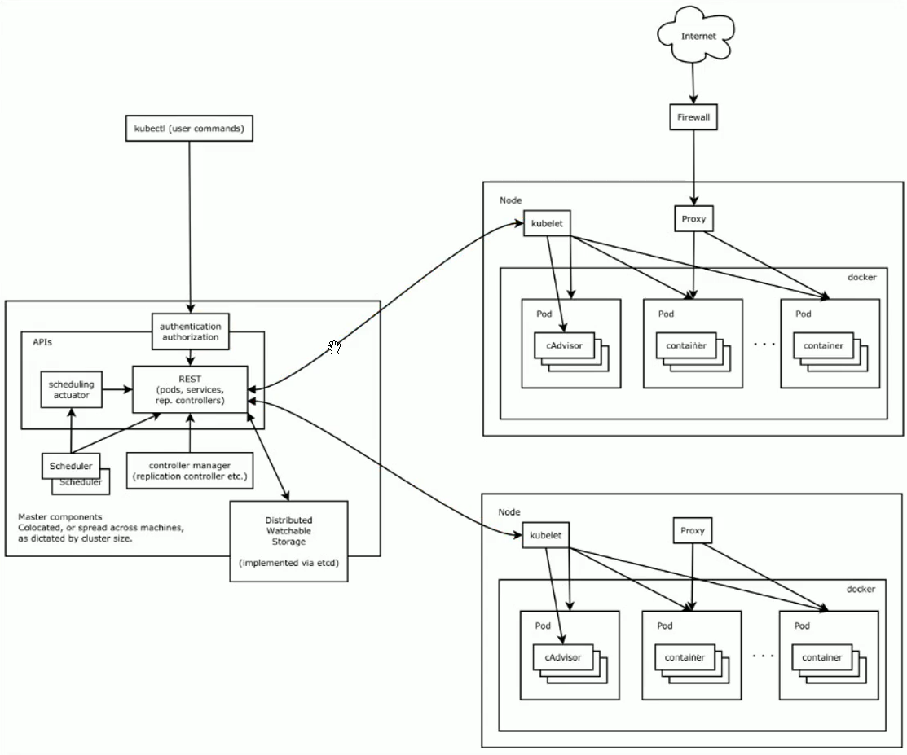

# 认证和鉴权

每个命令执行实际上都要先经过认证鉴权


RBAC（Role Based Access Control）

## 一、认证体系（4 种主流认证方式）

### 1. ServiceAccount 服务账号（Pod 内部访问 ApiServer 最常用）

1.1 原理

每个 namespace 自带 default SA，Pod 不指定 SA 自动挂载；SA 绑定 Secret，存放 JWT Token，Pod 内 `/var/run/secrets/kubernetes.io/serviceaccount/` 自动注入。

其实在学习storageClass的时候，为了能自动创建PV，就给`nfs-client-provisioner`创建了SA并分配了ClusterRole。

实操 1：创建自定义 ServiceAccount
```shell
# 创建命名空间
kubectl create ns auth-demo
# 创建serviceaccount
kubectl create sa app-sa -n auth-demo
# 查看sa
kubectl get sa -n auth-demo
# 查看绑定的secret
kubectl get secret -n auth-demo | grep app-sa
# 查看sa详情（包含token引用）
kubectl describe sa app-sa -n auth-demo
```

1.2 Pod 挂载自定义 SA yaml
```yaml
# sa-pod.yaml
apiVersion: v1
kind: Pod
metadata:
  name: sa-test-pod
  namespace: auth-demo
spec:
  # 指定使用自定义ServiceAccount，不使用default
  serviceAccountName: app-sa
  containers:
  - name: busybox
    image: busybox:1.35
    command: ["sleep", "36000"]
```

```shell
# 发布pod
kubectl apply -f sa-pod.yaml
# 进入pod验证token挂载目录
kubectl exec -it sa-test-pod -n auth-demo -- sh
# Pod内执行查看认证文件
ls /var/run/secrets/kubernetes.io/serviceaccount/
cat /var/run/secrets/kubernetes.io/serviceaccount/token
cat /var/run/secrets/kubernetes.io/serviceaccount/ca.crt
# 使用pod内token访问apiserver（无RBAC会报权限拒绝）
curl --cacert /var/run/secrets/kubernetes.io/serviceaccount/ca.crt \\
-H "Authorization: Bearer $(cat /var/run/secrets/kubernetes.io/serviceaccount/token)" \\
https://kubernetes.default.svc
```

1.3 提取 SA Token 给外部客户端使用
```shell
# 提取secret名称
SA_SECRET=$(kubectl get sa app-sa -n auth-demo -o jsonpath='{.secrets[0].name}')
# 输出原始token
kubectl get secret $SA_SECRET -n auth-demo -o jsonpath='{.data.token}' | base64 -d
```

### 2. X509 客户端证书认证（运维管理员、kubectl 默认）

**原理**

kubeconfig 存放客户端证书、CA 证书，ApiServer 校验证书 CN/O 字段识别用户 / 组。

**实操：查看当前 kubectl 证书身份**
```shell
# 查看kubeconfig当前上下文用户
kubectl config view
# 解析证书信息（CN=用户名，O=用户组）
openssl x509 -in ~/.kube/config -text | grep Subject
```

### 3. 静态 Token 文件认证（简单测试，生产少用）

ApiServer 启动参数指定 `--token-auth-file=/etc/kubernetes/token.csv`
格式：`token,用户名,用户组1,用户组2`

### 4. OIDC 第三方认证（企业 SSO，LDAP/OAuth）

企业统一登录平台对接 K8s，侧重内部运维常用 SA+RBAC。

## 二、鉴权核心：RBAC（Role、ClusterRole、RoleBinding、ClusterRoleBinding）

**概念区分**

1. **Role**：命名空间内权限（仅当前 ns 生效）
2. **ClusterRole**：集群全局权限（全 namespace、节点、PV 等集群资源）
3. **RoleBinding**：命名空间内绑定 User/SA/Group → Role
4. **ClusterRoleBinding**：全局绑定 User/SA/Group → ClusterRole

**资源权限语法**

`apiGroups` API 组、`resources` 资源、`verbs` 操作动作
verbs：`get/list/watch/create/update/patch/delete/deletecollection`

### 实操 1：命名空间内只读 Role + RoleBinding（SA 绑定）

rbac-ns-read.yaml
```yaml
# 1. 命名空间内只读Role
apiVersion: rbac.authorization.k8s.io/v1
kind: Role
metadata:
  name: ns-read-role
  namespace: auth-demo # 仅auth-demo命名空间生效
rules:
- apiGroups: [""] # core核心资源组（pod/service/pvc等）
  resources: ["pods", "services", "persistentvolumeclaims"]
  verbs: ["get", "list", "watch"] # 只读动作，无修改删除权限
---
# 2. RoleBinding：把app-sa绑定上面的Role
apiVersion: rbac.authorization.k8s.io/v1
kind: RoleBinding
metadata:
  name: bind-sa-read
  namespace: auth-demo
subjects:
# 绑定serviceAccount
- kind: ServiceAccount
  name: app-sa
  namespace: auth-demo
roleRef:
  kind: Role
  name: ns-read-role
  apiGroup: rbac.authorization.k8s.io
```

```shell
# 下发RBAC规则
kubectl apply -f rbac-ns-read.yaml
# 验证权限：使用pod内SA尝试删pod（会权限拒绝）
kubectl exec -it sa-test-pod -n auth-demo -- sh
# 容器内执行删除pod，403 Forbidden
curl -X DELETE --cacert /var/run/secrets/kubernetes.io/serviceaccount/ca.crt \\
-H "Authorization: Bearer $(cat /var/run/secrets/kubernetes.io/serviceaccount/token)" \\
https://kubernetes.default.svc/api/v1/namespaces/auth-demo/pods/sa-test-pod
```

### 实操 2：集群管理员 ClusterRole + ClusterRoleBinding

rbac-cluster-admin.yaml
```yaml
# ClusterRole 集群全局权限
apiVersion: rbac.authorization.k8s.io/v1
kind: ClusterRole
metadata:
  name: cluster-pv-admin
rules:
- apiGroups: [""]
  resources: ["persistentvolumes", "nodes"] # 集群级资源，无namespace
  verbs: ["get", "list", "watch", "create", "delete"]
---
# ClusterRoleBinding 全局绑定SA
apiVersion: rbac.authorization.k8s.io/v1
kind: ClusterRoleBinding
metadata:
  name: bind-sa-cluster-pv
subjects:
- kind: ServiceAccount
  name: app-sa
  namespace: auth-demo
roleRef:
  kind: ClusterRole
  name: cluster-pv-admin
  apiGroup: rbac.authorization.k8s.io
```

```shell
kubectl apply -f rbac-cluster-admin.yaml
# 验证SA现在可以查询集群所有节点、PV
kubectl exec -it sa-test-pod -n auth-demo -- curl --cacert /var/run/secrets/kubernetes.io/serviceaccount/ca.crt \
-H "Authorization: Bearer $(cat /var/run/secrets/kubernetes.io/serviceaccount/token)" \
https://kubernetes.default.svc/api/v1/nodes
```

### 实操 3：内置系统 ClusterRole（无需自己创建）

K8s 自带预置角色，直接绑定即可：

- `cluster-admin` 超级管理员（全权限）
- `admin` 命名空间管理员
- `edit` 命名空间编辑
- `view` 命名空间只读

```shell
# 将SA绑定内置view只读角色
kubectl create rolebinding sa-view-binding \
--clusterrole=view \
--serviceaccount=auth-demo:app-sa \
-n auth-demo
```

## 三、权限排查核心命令
```shell
# 1. 查看所有Role/RoleBinding/ClusterRole/ClusterRoleBinding
kubectl get role -n auth-demo
kubectl get rolebinding -n auth-demo
kubectl get clusterrole
kubectl get clusterrolebinding

# 2. 查看RBAC完整详情
kubectl describe role ns-read-role -n auth-demo
kubectl describe clusterrole cluster-pv-admin

# 3. 权限模拟校验（核心！判断某个SA能不能执行操作）
# 语法：kubectl auth can-i 动作 资源 --as=sa:命名空间:sa名称
kubectl auth can-i delete pods -n auth-demo --as=sa:auth-demo:app-sa
# 返回 no 代表无权限，yes代表有权限

kubectl auth can-i list nodes --as=sa:auth-demo:app-sa

# 4. 查看当前kubectl用户权限
kubectl auth can-i create deployments --all-namespaces

# 5. 查看某个SA绑定的所有权限
kubectl get rolebindings,clusterrolebindings -o json \
| jq '.items[] | select(.subjects[]?.name=="app-sa")'
```

## 四、准入控制（Admission，鉴权后二次拦截）

**两类准入控制器**

1. **内置准入插件**（ApiServer 启动参数开启）：NamespaceLifecycle、LimitRanger、ResourceQuota、PodSecurity
2. **自定义 Webhook 准入**：ValidatingWebhook（校验拒绝）、MutatingWebhook（修改资源）

### 实操 1：ResourceQuota 资源配额准入（限制 ns 总 CPU 内存 / PVC 数量）
```yaml
# quota-demo.yaml
apiVersion: v1
kind: ResourceQuota
metadata:
  name: ns-quota
  namespace: auth-demo
spec:
  hard:
    pods: "10"               # 最多10个pod
    requests.cpu: "2"        # 总申请CPU不超2核
    requests.memory: 2Gi     # 总申请内存不超2G
    persistentvolumeclaims: "5" # 最多5个PVC
```

```shell
kubectl apply -f quota-demo.yaml
kubectl get resourcequota -n auth-demo
kubectl describe resourcequota ns-quota -n auth-demo
# 创建超出配额的pod会直接准入失败
```

### 实操 2：PodSecurity 安全准入（替代旧 PodSecurityPolicy）

分三级：privileged（无限制）、baseline（基础安全）、restricted（严格安全）
```shell
# 给命名空间打安全标签，强制restricted策略
kubectl label ns auth-demo pod-security.kubernetes.io/enforce=restricted
# 创建特权容器pod会被准入拦截，创建失败
```

## 五、kubeconfig 客户端认证配置实操

kubeconfig 三段核心：Cluster 集群地址、User 身份、Context 关联集群 + 用户

命令行快速生成 kubeconfig（SA Token 登录集群）
```shell
# 变量定义
NS=auth-demo
SA=app-sa
CLUSTER_NAME=k8s-cluster
API_SERVER=https://192.168.1.100:6443

# 1. 获取SA token
SA_SECRET=$(kubectl get sa $SA -n $NS -o jsonpath='{.secrets[0].name}')
SA_TOKEN=$(kubectl get secret $SA_SECRET -n $NS -o jsonpath='{.data.token}' | base64 -d)

# 2. 获取集群CA证书
CA_CERT=$(kubectl config view --raw -o jsonpath='{.clusters[0].cluster.certificate-authority-data}')

# 3. 写入kubeconfig配置
kubectl config set-credentials $SA-user --token="$SA_TOKEN"
kubectl config set-cluster $CLUSTER_NAME --server=$API_SERVER --certificate-authority-data="$CA_CERT"
kubectl config set-context $SA-ctx --cluster=$CLUSTER_NAME --user=$SA-user --namespace=$NS
# 切换上下文
kubectl config use-context $SA-ctx
# 验证权限
kubectl get pods
```

## 六、完整清理命令
```shell
# 删除rbac资源
kubectl delete role,rolebinding,clusterrole,clusterrolebinding -n auth-demo --all
# 删除sa、pod、quota
kubectl delete sa app-sa -n auth-demo
kubectl delete pod sa-test-pod -n auth-demo
kubectl delete resourcequota ns-quota -n auth-demo
# 删除命名空间
kubectl delete ns auth-demo
```