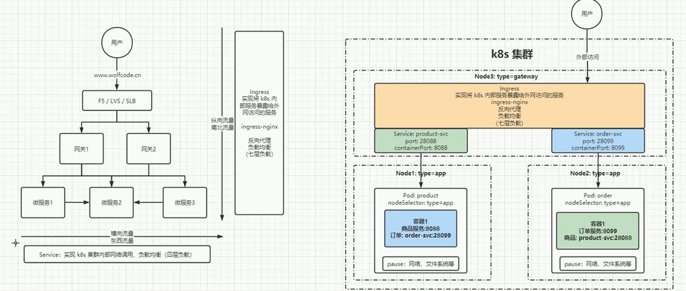
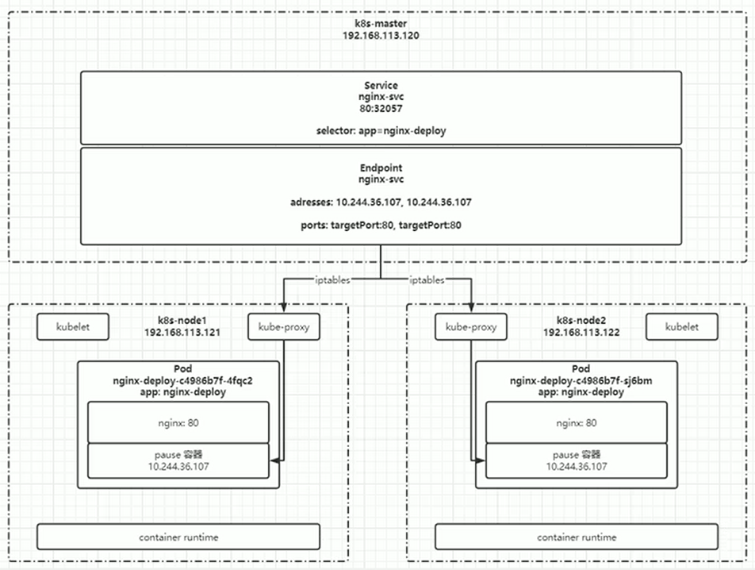

# service、endpoint、pod之间的关系和原理

## k8s的网络通信

如下方左图所示，东西向微服务之间通过service来互相访问，南北向用户通过ingress来访问。
最上层是负载均衡，接着是网关，最后是实际提供服务的微服务。

右图更详细一些，node分为了网关类型和应用类型，ingress部署在网关类型的node上，并提供反向代理服务。
pod通过nodeSelector部署在应用类型的node上，通过service对外暴露端口。

访问顺序是ingress->service->pod。



## svc、ep、pod之间的关系

1. 在master节点上有控制器，负责管理service，service的名称是nginx-svc，通过这个名字就可以
找到endpoint（名字也是nginx-svc），找到ep就找到了地址。
2. 接着可以通过kube-proxy找到部署在各个slave节点上的pod。


所以访问顺序是service->endpoint->pod

## service的配置和基础命令

带注释的配置
```yaml
# API资源版本，固定v1，Service属于核心基础资源
apiVersion: v1
# 资源类型：Service 服务对象
kind: Service
# 资源元数据：名称、命名空间、标签、注解
metadata:
  # Service名称，集群内同namespace唯一，集群内DNS访问域名就是该名称
  name: business-web-svc
  # 命名空间，不写默认default，多业务隔离时指定
  namespace: business-system
  # 自定义标签，用于筛选、资源分组、监控匹配
  labels:
    app: business-web
    module: front-end
    env: online
  # 注解，存放扩展配置、说明、灰度、Ingress配套参数等
  annotations:
    # 示例：标记业务负责人
    owner: "zhangsan@shturl."
    # 示例：开启ipvs负载均衡会话保持
    kubernetes.io/service-sticky-session: "true"

# Service核心业务配置
spec:
  # 标签选择器：匹配后端Pod的labels，匹配成功后endpoint-controller自动同步PodIP到Endpoints
  # 关键：service通过selector关联Pod，不写selector代表手动维护Endpoints（对接外部服务）
  selector:
    app: business-web
    module: front-end

  # 端口配置数组，支持多端口映射
  ports:
    # 单端口配置块
    - name: http-8080       # 端口名称，多端口场景必须唯一，供Ingress/探针引用
      port: 80              # Service自身暴露的集群访问端口，集群内访问svc:port
      targetPort: 8080      # 转发到后端Pod内部容器监听的端口
      protocol: TCP         # 传输协议，支持TCP/UDP/SCTP，Web业务默认TCP
      nodePort: 30080       # NodePort类型专用：节点宿主机对外开放端口，范围30000-32767；ClusterIP可省略

  # Service四种类型，可选值：ClusterIP / NodePort / LoadBalancer / ExternalName
  # ClusterIP：默认，仅集群内部可访问，无宿主机端口，内网服务首选
  type: ClusterIP

  # 仅type=LoadBalancer时生效，指定云厂商负载均衡公网IP，私有集群一般不配置
  # loadBalancerIP: 123.123.123.123

  # 外部流量策略：Local/Cluster
  # Local：流量只转发到当前节点本地Pod，保留客户端真实源IP；Cluster：跨节点转发（默认）
  externalTrafficPolicy: Local

  # 会话保持会话超时时间，单位秒，0代表关闭会话保持
  sessionAffinity: ClientIP
  sessionAffinityConfig:
    clientIP:
      timeoutSeconds: 10800

  # 排除指定节点IP，不纳入负载均衡后端（极少使用）
  # externalIPs:
  #   - 10.0.0.10

  # 无头服务专用配置（clusterIP: None），不分配固定ClusterIP，直接解析所有Pod IP做DNS轮询，多用于StatefulSet
  # clusterIP: None

  # 为Service分配固定集群内网IP，不写则集群自动随机分配，指定IP必须在集群service-cidr网段内且未占用
  # clusterIP: 10.96.120.100

  # IP家族策略，双栈集群使用：SingleStack/PreferDualStack/RequireDualStack
  ipFamilyPolicy: SingleStack
  # IP协议版本，IPv4/IPv6
  ipFamilies:
    - IPv4
```

带注释的基础命令
```shell
# ===================== K8s Service 全套操作命令（统一代码块，带注释，可直接复制保存MD） =====================
# 一、创建/更新Service资源
# 根据yaml文件创建或更新Service（推荐标准用法，存在则更新，不存在则新建）
kubectl apply -f svc-demo.yaml
# 命令行快速创建ClusterIP类型服务，绑定标签app=web，端口80转发到Pod 8080
kubectl create service clusterip web-svc --tcp=80:8080 --selector=app=web
# 命令行创建NodePort类型服务，指定宿主机暴露端口30080
kubectl create service nodeport web-svc --tcp=80:8080 --node-port=30080

# 二、查询查看Service信息
# 查看默认命名空间所有Service简易列表
kubectl get svc
# 指定业务命名空间查看所有Service
kubectl get svc -n business-system
# 查看集群全部命名空间下所有Service
kubectl get svc --all-namespaces
# 查看指定Service完整详情（端口、selector、事件、关联端点）
kubectl describe svc web-svc -n business-system
# YAML格式导出Service完整配置，用于备份迁移
kubectl get svc web-svc -o yaml
# JSON格式导出Service完整配置
kubectl get svc web-svc -o json
# 同时查看Service、Pod、Endpoint三者关联关系，直观验证后端挂载状态
kubectl get svc,pod,ep -o wide -n business-system
# 实时监听Endpoint变更，扩容/缩容时观察后端PodIP列表变化
kubectl get ep web-svc -w

# 三、在线修改更新Service配置
# 拉起编辑器在线编辑Service全部配置，保存立即生效
kubectl edit svc web-svc -n business-system
# 补丁方式修改Service标签，无需修改yaml文件
kubectl patch svc web-svc -p '{"metadata":{"labels":{"env":"prod"}}}' -n business-system
# 补丁方式修改Service端口映射关系
kubectl patch svc web-svc -p '{"spec":{"ports":[{"port":80,"targetPort":8088}]}}' -n business-system

# 四、集群内测试访问Service
# 临时启动busybox容器，通过Service域名访问内部服务，自动销毁测试容器
kubectl run test-box --image=busybox --rm -it -- wget -q -O- http://web-svc
# 测试集群DNS解析，验证Service域名是否可正常解析
kubectl run dns-test --image=busybox --rm -it -- nslookup web-svc
# 直接使用Service集群IP发起访问
curl http://10.96.150.20

# 五、删除Service资源
# 通过yaml文件删除对应Service
kubectl delete -f svc-demo.yaml
# 根据服务名删除指定命名空间下Service
kubectl delete svc web-svc -n business-system
# 批量清空当前命名空间所有Service（谨慎执行，生产慎用）
kubectl delete svc --all

# 六、导出备份现有Service配置
# 单条Service配置导出到本地yaml备份文件
kubectl get svc web-svc -o yaml > svc-backup.yaml
# 导出当前命名空间全部Service配置统一备份
kubectl get svc -o yaml > all-svc-backup.yaml

# 七、故障排查核心配套命令（解决503无后端报错）
# 查看Service自动生成的Endpoint列表，为空代表未匹配到就绪Pod
kubectl get endpoints web-svc -n business-system
# 查看Endpoint详细信息，区分就绪/未就绪PodIP地址
kubectl describe ep web-svc -n business-system

# ===================== 补充简写参数说明 =====================
# svc = service 资源简写，kubectl get service 与 kubectl get svc 效果完全一致
# -n ：指定命名空间，多业务隔离集群必须携带
# -o wide ：展示扩展信息，包含IP、节点、标签等
# -w ：实时监听资源变化，持续刷新输出
```

## 基于service访问外部服务

通过 Service 访问外部域名，使用 ExternalName 类型 Service：
* 无需 selector、不会自动生成 Endpoints；
* 集群 DNS 解析 Service 名称时，直接 CNAME 转发到你配置的外部域名；
* 适合统一收口第三方接口、外部数据库、第三方 API，业务代码只依赖内部 Service 名称，外部地址变更只改 Service 配置，不用改所有 Pod 代码。

完整实操（含 YAML + 全套验证命令，单块代码方便存 MD）

创建external-demo-svc.yaml
```yaml
apiVersion: v1
kind: Service
metadata:
  # 集群内访问域名：external-api
  name: external-api
  namespace: default
spec:
  # 类型ExternalName，专门用于映射外部域名
  type: ExternalName
  # 填写真实外部域名，支持带端口场景单独配置ports
  externalName: www.baidu.com
  ports:
    # 集群内部统一访问80端口，映射外部80端口
    - port: 80
      targetPort: 80
      protocol: TCP
```

```shell
# 2. 应用创建外部服务Service
kubectl apply -f external-demo-svc.yaml

# 3. 查看创建后的Service信息
kubectl get svc external-api

# 4. 查看Service完整配置，确认externalName绑定外部域名
kubectl describe svc external-api

# 5. 进入临时测试Pod，验证DNS解析（核心：Service名称CNAME到外部域名）
kubectl run dns-test --image=busybox --rm -it -- nslookup external-api

# 6. 通过Service名称访问外部域名，业务Pod无需写真实外部地址
kubectl run curl-test --image=busybox --rm -it -- wget -q -O- http://external-api

# 7. 若外部服务是非80端口，举例：外部接口api.xxx.com:8080，修改ports与externalName即可
# cat > external-api-8080.yaml << EOF
# apiVersion: v1
# kind: Service
# metadata:
#   name: external-api-8080
# spec:
#   type: ExternalName
#   externalName: api.xxx.com
#   ports:
#   - port: 80
#     targetPort: 8080
# EOF

# 8. 删除ExternalName服务
kubectl delete -f external-demo-svc.yaml
kubectl delete svc external-api
```


